Mixture Models and the EM Algorithm

Shanshan Song

songss@tongji.edu.cn

School of Mathematical Sciences

Tongji University

November 20, 2025

## Problems: Image Segmentation

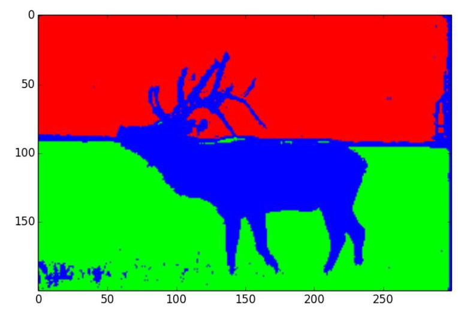

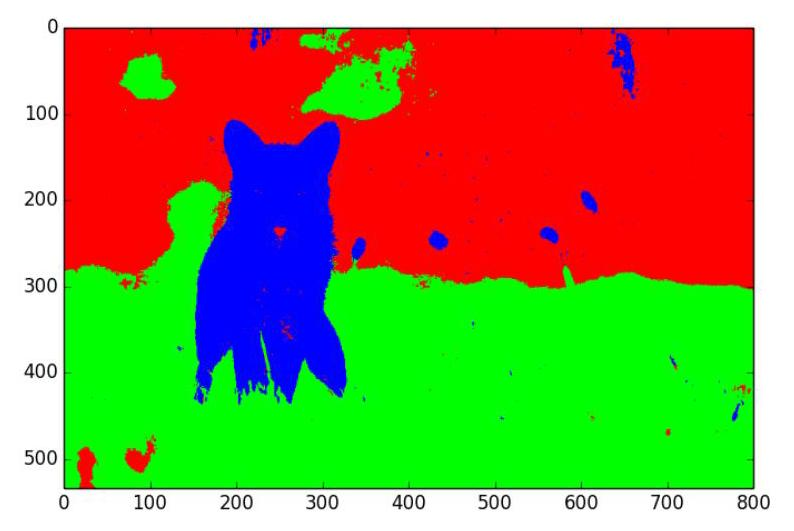

## Problems: Question Clustering

## Content

D Latent Variable Models

- Mixture Models

- Gaussian Mixture Models

- EM Algorithm

## Introduction to Latent Variable Models (LVMs)

- Definition: Latent Variable Models (LVMs) are probabilistic models that introduce unobserved latent variables to explain the underlying structure in observed data.

## Introduction to Latent Variable Models (LVMs)

- Definition: Latent Variable Models (LVMs) are probabilistic models that introduce unobserved latent variables to explain the underlying structure in observed data.

- $X$ : Observed variables.

- $Z$ : Latent variables.

## Introduction to Latent Variable Models (LVMs)

- Definition: Latent Variable Models (LVMs) are probabilistic models that introduce unobserved latent variables to explain the underlying structure in observed data.

- $X$ : Observed variables.

- Z: Latent variables.

## Assumptions:

- The types of $p\left( {Z;\theta }\right)$ is known with some unknown parameters: Gaussian or discrete distributions.

## Introduction to Latent Variable Models (LVMs)

- Definition: Latent Variable Models (LVMs) are probabilistic models that introduce unobserved latent variables to explain the underlying structure in observed data.

- $X$ : Observed variables.

- Z: Latent variables.

## Assumptions:

- The types of $p\left( {Z;\theta }\right)$ is known with some unknown parameters: Gaussian or discrete distributions.

The types of $p\left( {X \mid  Z;\theta }\right)$ are known with some unknown parameters.

## Introduction to Latent Variable Models (LVMs)

- Definition: Latent Variable Models (LVMs) are probabilistic models that introduce unobserved latent variables to explain the underlying structure in observed data.

- $X$ : Observed variables.

- $Z$ : Latent variables.

## Assumptions:

- The types of $p\left( {Z;\theta }\right)$ is known with some unknown parameters: Gaussian or discrete distributions.

- The types of $p\left( {X \mid  Z;\theta }\right)$ are known with some unknown parameters.

## Models:

Joint distribution:

$$
p\left( {X, Z;\theta }\right)  = p\left( {Z;\theta }\right) p\left( {X \mid  Z;\theta }\right)
$$

## Introduction to Latent Variable Models (LVMs)

- Definition: Latent Variable Models (LVMs) are probabilistic models that introduce unobserved latent variables to explain the underlying structure in observed data.

- $X$ : Observed variables.

- $Z$ : Latent variables.

## Assumptions:

- The types of $p\left( {Z;\theta }\right)$ is known with some unknown parameters: Gaussian or discrete distributions.

- The types of $p\left( {X|Z;\theta }\right)$ are known with some unknown parameters.

## Models:

Joint distribution:

$$
p\left( {X, Z;\theta }\right)  = p\left( {Z;\theta }\right) p\left( {X \mid  Z;\theta }\right)
$$

Marginal distribution (eliminating $Z$ ):

## Introduction to Latent Variable Models (LVMs)

- Definition: Latent Variable Models (LVMs) are probabilistic models that introduce unobserved latent variables to explain the underlying structure in observed data.

- $X$ : Observed variables.

- $Z$ : Latent variables.

## Assumptions:

- The types of $p\left( {Z;\theta }\right)$ is known with some unknown parameters: Gaussian or discrete distributions.

- The types of $p\left( {X \mid  Z;\theta }\right)$ are known with some unknown parameters.

## Models:

- Joint distribution:

$$
p\left( {X, Z;\theta }\right)  = p\left( {Z;\theta }\right) p\left( {X \mid  Z;\theta }\right)
$$

- Marginal distribution (eliminating $Z$ ):

$$
\mathbf{p}\left( {\mathbf{X};\theta }\right)  = \mathop{\sum }\limits_{Z}p\left( {X, Z;\theta }\right) \;\left( {\text{ discrete }Z}\right)
$$

## Introduction to Latent Variable Models (LVMs)

- Definition: Latent Variable Models (LVMs) are probabilistic models that introduce unobserved latent variables to explain the underlying structure in observed data.

- X: Observed variables.

- Z: Latent variables.

## Assumptions:

- The types of $p\left( {Z;\theta }\right)$ is known with some unknown parameters: Gaussian or discrete distributions.

- The types of $p\left( {X \mid  Z;\theta }\right)$ are known with some unknown parameters.

## Models:

- Joint distribution:

$$
p\left( {X, Z;\theta }\right)  = p\left( {Z;\theta }\right) p\left( {X \mid  Z;\theta }\right)
$$

- Marginal distribution (eliminating $Z$ ):

$$
\mathbf{p}\left( {\mathbf{X};\theta }\right)  = \mathop{\sum }\limits_{Z}p\left( {X, Z;\theta }\right) \;\left( {\text{ discrete }Z}\right)
$$

$$
\mathbf{p}\left( {\mathbf{X};\theta }\right)  = {\int }_{Z}p\left( {X, Z;\theta }\right) {dZ}\;\left( {\text{ continuous }Z}\right)
$$

LVMs

MINIST (1998):

504/98313 dimension ${28} \times  {28}$

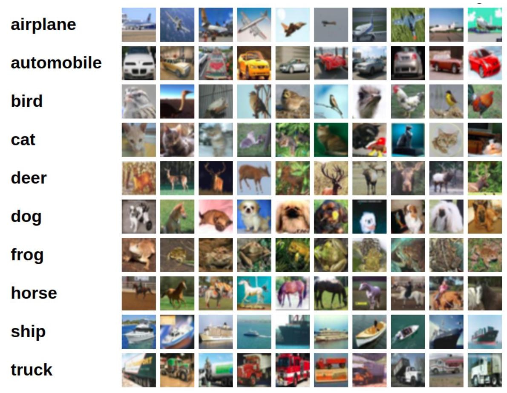

CIFAR10 (2009):

dimension ${32} \times  {32} \times  3$

## LVMs

- Role of Latent Variables:

- Interpretability: Decompose complex observations into simpler structures.

## LVMs

## Role of Latent Variables:

- Interpretability: Decompose complex observations into simpler structures.

- Dimensionality reduction: Represent high-dimensional $X$ with low-dimensional $Z$ .

## LVMs

## Role of Latent Variables:

- Interpretability: Decompose complex observations into simpler structures.

- Dimensionality reduction: Represent high-dimensional $X$ with low-dimensional $Z$ .

- Generative modeling: Simulate the data generation process by $p\left( {Z;\theta }\right)$ and $p\left( {X \mid  Z;\theta }\right)$ .

## LVMs

- Role of Latent Variables:

- Interpretability: Decompose complex observations into simpler structures.

- Dimensionality reduction: Represent high-dimensional $X$ with low-dimensional $Z$ .

- Generative modeling: Simulate the data generation process by $p\left( {Z;\theta }\right)$ and $p\left( {X \mid  Z;\theta }\right)$ .

> Types of Latent Variable Models:

## LVMs

Prole of Latent Variables:

- Interpretability: Decompose complex observations into simpler structures.

- Dimensionality reduction: Represent high-dimensional $X$ with low-dimensional $Z$ .

- Generative modeling: Simulate the data generation process by $p\left( {Z;\theta }\right)$ and $p\left( {X \mid  Z;\theta }\right)$ .

Types of Latent Variable Models:

Discrete latent variables: Used for clustering, classification.

## LVMs

## Prole of Latent Variables:

- Interpretability: Decompose complex observations into simpler structures.

- Dimensionality reduction: Represent high-dimensional $X$ with low-dimensional $Z$ .

- Generative modeling: Simulate the data generation process by $p\left( {Z;\theta }\right)$ and $p\left( {X \mid  Z;\theta }\right)$ .

Types of Latent Variable Models:

Discrete latent variables: Used for clustering, classification.

Examples: Mixture Models, Hidden Markov Models (HMM).

## LVMs

## Prole of Latent Variables:

- Interpretability: Decompose complex observations into simpler structures.

- Dimensionality reduction: Represent high-dimensional $X$ with low-dimensional $Z$ .

- Generative modeling: Simulate the data generation process by $p\left( {Z;\theta }\right)$ and $p\left( {X \mid  Z;\theta }\right)$ .

## Types of Latent Variable Models:

Discrete latent variables: Used for clustering, classification.

- Examples: Mixture Models, Hidden Markov Models (HMM).

- Continuous latent variables: Used for dimensionality reduction, feature learning.

## LVMs

## Role of Latent Variables:

- Interpretability: Decompose complex observations into simpler structures.

- Dimensionality reduction: Represent high-dimensional $X$ with low-dimensional $Z$ .

S Generative modeling: Simulate the data generation process by $p\left( {Z;\theta }\right)$ and $p\left( {X \mid  Z;\theta }\right)$ .

## Types of Latent Variable Models:

Discrete latent variables: Used for clustering, classification.

Examples: Mixture Models, Hidden Markov Models (HMM).

Continuous latent variables: Used for dimensionality reduction, feature learning.

- Examples: Latent linear models (Chapter 12) [factor analysis model and Principal components analysis (PCA)]

$$
p\left( {Z;\theta }\right)  = \mathcal{N}\left( {{z}_{i} \mid  {\mu }_{0},{\sum }_{0}}\right)
$$

$$
p\left( {X \mid  Z;\theta }\right)  = \mathcal{N}\left( {W{z}_{i} + \mu ,{I}_{d}}\right)
$$

## Introduction to Mixture Models

Mixture Model Definition: With $p\left( {z;\theta }\right)  =$ Categorical $\left( {\left\{  {\pi }_{k}\right\}  }_{k = 1}^{K}\right)$ and denote $p\left( {\mathbf{x} \mid  Z = k;\theta }\right)  = {p}_{k}\left( {x;\theta }\right) , k = 1,\ldots , K$ , the marginal density function of $X$ is

$$
p\left( {\mathbf{x};\theta }\right)  = \mathop{\sum }\limits_{{k = 1}}^{K}{\pi }_{k} \cdot  {p}_{k}\left( {\mathbf{x};\theta }\right) .
$$

## Introduction to Mixture Models

Mixture Model Definition: With $p\left( {z;\theta }\right)  = \operatorname{Categorical}\left( {\left\{  {\pi }_{k}\right\}  }_{k = 1}^{K}\right)$ and denote $p\left( {\mathbf{x} \mid  Z = k;\theta }\right)  = {p}_{k}\left( {x;\theta }\right) , k = 1,\ldots , K$ , the marginal density function of $X$ is

$$
p\left( {\mathbf{x};\theta }\right)  = \mathop{\sum }\limits_{{k = 1}}^{K}{\pi }_{k} \cdot  {p}_{k}\left( {\mathbf{x};\theta }\right) .
$$

- Convex combination of the ${p}_{k}$ ’s

## Introduction to Mixture Models

Mixture Model Definition: With $p\left( {z;\theta }\right)  = \operatorname{Categorical}\left( {\left\{  {\pi }_{k}\right\}  }_{k = 1}^{K}\right)$ and denote $p\left( {\mathbf{x} \mid  Z = k;\theta }\right)  = {p}_{k}\left( {x;\theta }\right) , k = 1,\ldots , K$ , the marginal density function of $X$ is

$$
p\left( {\mathbf{x};\theta }\right)  = \mathop{\sum }\limits_{{k = 1}}^{K}{\pi }_{k} \cdot  {p}_{k}\left( {\mathbf{x};\theta }\right) .
$$

- Convex combination of the ${p}_{k}$ ’s

- Generative Process:

1. Select a cluster ${z}_{i} \sim$ Categorical $\left( \pi \right)$ .

## Introduction to Mixture Models

Mixture Model Definition: With $p\left( {z;\theta }\right)  =$ Categorical $\left( {\left\{  {\pi }_{k}\right\}  }_{k = 1}^{K}\right)$ and denote $p\left( {\mathbf{x} \mid  Z = k;\theta }\right)  = {p}_{k}\left( {x;\theta }\right) , k = 1,\ldots , K$ , the marginal density function of $X$ is

$$
p\left( {\mathbf{x};\theta }\right)  = \mathop{\sum }\limits_{{k = 1}}^{K}{\pi }_{k} \cdot  {p}_{k}\left( {\mathbf{x};\theta }\right) .
$$

- Convex combination of the ${p}_{k}$ ’s

- Generative Process:

1. Select a cluster ${z}_{i} \sim$ Categorical $\left( \pi \right)$ .

2. Generate ${x}_{i} \sim  {p}_{k}\left( {x;\theta }\right)$ .

## Introduction to Gaussian Mixture Models

Gaussian Mixture Model (GMM) Definition: With $p\left( {\mathbf{x} \mid  Z = k;\theta }\right)  = \mathcal{N}\left( {\mathbf{x} \mid  {\mathbf{\mu }}_{k},{\mathbf{\sum }}_{k}}\right) , k = 1,\ldots , K$ , the marginal density function of $X$ is

$$
p\left( \mathbf{x}\right)  = \mathop{\sum }\limits_{{k = 1}}^{K}{\pi }_{k} \cdot  \mathcal{N}\left( {\mathbf{x} \mid  {\mathbf{\mu }}_{k},{\mathbf{\sum }}_{k}}\right) ,
$$

where

$$
\mathcal{N}\left( {\mathbf{x} \mid  {\mathbf{\mu }}_{k},{\mathbf{\sum }}_{k}}\right)  = \frac{1}{{\left( 2\pi \right) }^{d/2}{\left| {\mathbf{\sum }}_{k}\right| }^{1/2}}\exp \left( {-\frac{1}{2}{\left( \mathbf{x} - {\mathbf{\mu }}_{k}\right) }^{\top }{\mathbf{\sum }}_{k}^{-1}\left( {\mathbf{x} - {\mathbf{\mu }}_{k}}\right) }\right) .
$$

## Introduction to Gaussian Mixture Models

Gaussian Mixture Model (GMM) Definition: With $p\left( {\mathbf{x} \mid  Z = k;\theta }\right)  = \mathcal{N}\left( {\mathbf{x} \mid  {\mathbf{\mu }}_{k},{\mathbf{\sum }}_{k}}\right) , k = 1,\ldots , K$ , the marginal density function of $X$ is

$$
p\left( \mathbf{x}\right)  = \mathop{\sum }\limits_{{k = 1}}^{K}{\pi }_{k} \cdot  \mathcal{N}\left( {\mathbf{x} \mid  {\mathbf{\mu }}_{k},{\mathbf{\sum }}_{k}}\right) ,
$$

where

$$
\mathcal{N}\left( {\mathbf{x} \mid  {\mathbf{\mu }}_{k},{\mathbf{\sum }}_{k}}\right)  = \frac{1}{{\left( 2\pi \right) }^{d/2}{\left| {\mathbf{\sum }}_{k}\right| }^{1/2}}\exp \left( {-\frac{1}{2}{\left( \mathbf{x} - {\mathbf{\mu }}_{k}\right) }^{\top }{\mathbf{\sum }}_{k}^{-1}\left( {\mathbf{x} - {\mathbf{\mu }}_{k}}\right) }\right) .
$$

- Given a sufficiently large number of mixture components $K$ , a GMM can be used to approximate any density defined on ${\mathbb{R}}^{d}$ .

Approximation Power of GMMs

Click the link below: Approximation Power of GMMs

GMMs with $d = 2$

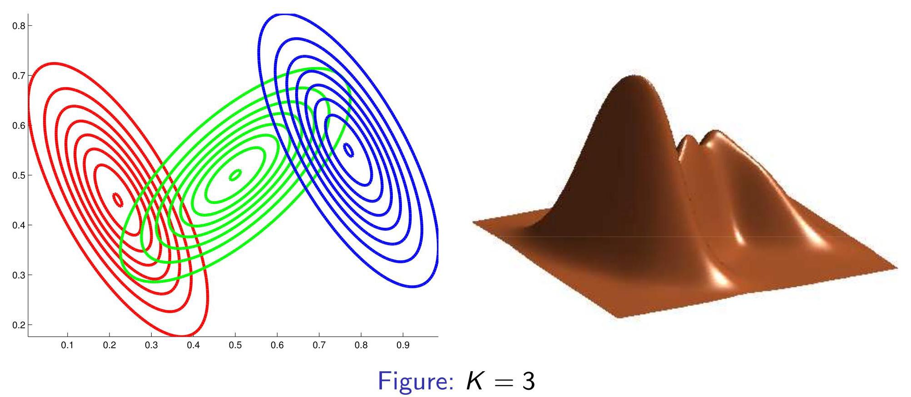

## Image Segmentation

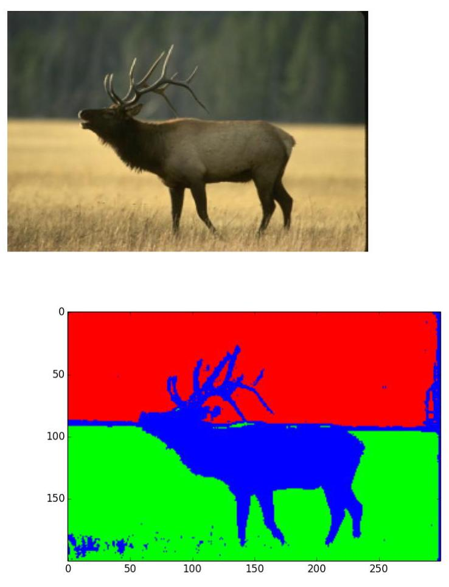

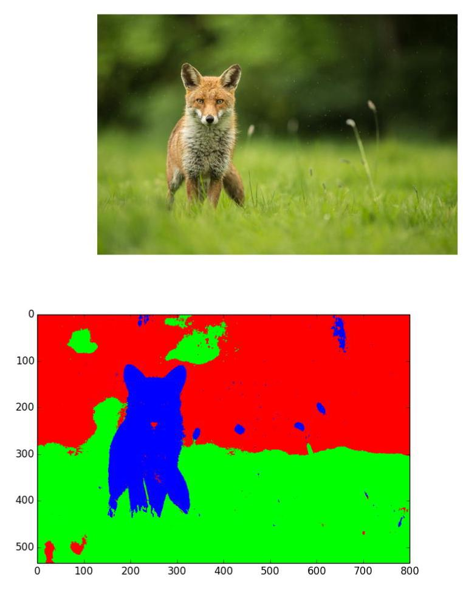

Figure: Link: https://github.com/laituan245/image-segmentation-GMM

## Other Mixture Models

- Other choices of $p\left( {\mathbf{x} \mid  Z = k;\theta }\right)$ : Bernoullis distribution $\rightarrow$ Mixture of multinoullis

$$
\begin{array}{l} p\left( {{\mathbf{x}}_{i}|Z = k;{\mathbf{\mu }}_{k}}\right)  = {\Pi }_{j = 1}^{d}\mathbf{B}\left( {{x}_{ij}|{\mu }_{jk}}\right)  = {\Pi }_{j = 1}^{d}{\mu }_{jk}^{{x}_{ij}}{\left( 1 - {\mu }_{jk}\right) }^{1 - {x}_{ij}} \end{array}
$$

## Other Mixture Models

- Other choices of $p\left( {\mathbf{x} \mid  Z = k;\theta }\right)$ : Bernoullis distribution $\rightarrow$ Mixture of multinoullis

$$
\begin{array}{l} p\left( {{\mathbf{x}}_{i}|Z = k;{\mathbf{\mu }}_{k}}\right)  = {\Pi }_{j = 1}^{d}\mathbf{B}\left( {{x}_{ij}|{\mu }_{jk}}\right)  = {\Pi }_{j = 1}^{d}{\mu }_{jk}^{{x}_{ij}}{\left( 1 - {\mu }_{jk}\right) }^{1 - {x}_{ij}} \end{array}
$$

The mean and covariance of this mixture distribution are given by

$$
\mathbb{E}\left( \mathbf{x}\right)  = \mathop{\sum }\limits_{k}{\pi }_{k}{\mathbf{\mu }}_{k}
$$

$$
\operatorname{cov}\left( \mathbf{x}\right)  = \mathop{\sum }\limits_{k}{\pi }_{k}\left\lbrack  {{\mathbf{\sum }}_{k} + {\mathbf{\mu }}_{k}{\mathbf{\mu }}_{k}^{\top }}\right\rbrack   - \mathbb{E}\left( \mathbf{x}\right) \mathbb{E}{\left( \mathbf{x}\right) }^{\top },
$$

where ${\mathbf{\sum }}_{k} = \operatorname{diag}\left( {{\mathbf{\mu }}_{jk}\left( {1 - {\mathbf{\mu }}_{jk}}\right) }\right)$ .

## Application: Clustering

After fitting the mixture model, one can compute the posterior probability that point $i$ belongs to cluster $k$ by bayes rule:

$$
{r}_{ik} :  = p\left( {{z}_{i} = k|{\mathbf{x}}_{i};\theta }\right)  = \frac{p\left( {{z}_{i} = k;\theta }\right) p\left( {{\mathbf{x}}_{i} \mid  {z}_{i} = k;\theta }\right) }{\mathop{\sum }\limits_{{k = 1}}^{K}p\left( {{z}_{i} = k;\theta }\right) p\left( {{\mathbf{x}}_{i} \mid  {z}_{i} = k;\theta }\right) }.
$$

## Application: Clustering

After fitting the mixture model, one can compute the posterior probability that point $i$ belongs to cluster $k$ by bayes rule:

$$
{r}_{ik} :  = p\left( {{z}_{i} = k|{\mathbf{x}}_{i};\theta }\right)  = \frac{p\left( {{z}_{i} = k;\theta }\right) p\left( {{\mathbf{x}}_{i} \mid  {z}_{i} = k;\theta }\right) }{\mathop{\sum }\limits_{{k = 1}}^{K}p\left( {{z}_{i} = k;\theta }\right) p\left( {{\mathbf{x}}_{i} \mid  {z}_{i} = k;\theta }\right) }.
$$

- Degree of uncertainty in the cluster assignment: $1 - \mathop{\max }\limits_{k}{r}_{ik}$

## Application: Clustering

After fitting the mixture model, one can compute the posterior probability that point $i$ belongs to cluster $k$ by bayes rule:

$$
{r}_{ik} :  = p\left( {{z}_{i} = k|{\mathbf{x}}_{i};\theta }\right)  = \frac{p\left( {{z}_{i} = k;\theta }\right) p\left( {{\mathbf{x}}_{i} \mid  {z}_{i} = k;\theta }\right) }{\mathop{\sum }\limits_{{k = 1}}^{K}p\left( {{z}_{i} = k;\theta }\right) p\left( {{\mathbf{x}}_{i} \mid  {z}_{i} = k;\theta }\right) }.
$$

- Degree of uncertainty in the cluster assignment: $1 - \mathop{\max }\limits_{k}{r}_{ik}$

$$
\begin{array}{l} {z}_{i}^{ \star  } = \arg \mathop{\max }\limits_{k}{r}_{ik} = \arg \mathop{\max }\limits_{k}\{ \log p\left( {{z}_{i} = k;\theta }\right)  + \log p\left( {{\mathbf{x}}_{i}|{z}_{i} = k;\theta }\right) \}  \end{array}
$$

## Application: Clustering

After fitting the mixture model, one can compute the posterior probability that point $i$ belongs to cluster $k$ by bayes rule:

$$
{r}_{ik} :  = p\left( {{z}_{i} = k|{\mathbf{x}}_{i};\theta }\right)  = \frac{p\left( {{z}_{i} = k;\theta }\right) p\left( {{\mathbf{x}}_{i} \mid  {z}_{i} = k;\theta }\right) }{\mathop{\sum }\limits_{{k = 1}}^{K}p\left( {{z}_{i} = k;\theta }\right) p\left( {{\mathbf{x}}_{i} \mid  {z}_{i} = k;\theta }\right) }.
$$

Degree of uncertainty in the cluster assignment: $1 - \mathop{\max }\limits_{k}{r}_{ik}$

$$
\begin{array}{l} {z}_{i}^{ \star  } = \arg \mathop{\max }\limits_{k}{r}_{ik} = \arg \mathop{\max }\limits_{k}\{ \log p\left( {{z}_{i} = k;\theta }\right)  + \log p\left( {{\mathbf{x}}_{i}|{z}_{i} = k;\theta }\right) \}  \end{array}
$$

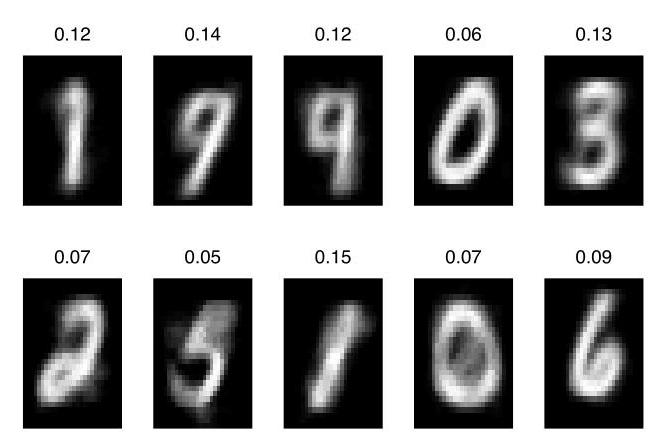

## Application: Clustering

After fitting the mixture model, one can compute the posterior probability that point $i$ belongs to cluster $k$ by bayes rule:

$$
{r}_{ik} :  = p\left( {{z}_{i} = k|{\mathbf{x}}_{i};\theta }\right)  = \frac{p\left( {{z}_{i} = k;\theta }\right) p\left( {{\mathbf{x}}_{i} \mid  {z}_{i} = k;\theta }\right) }{\mathop{\sum }\limits_{{k = 1}}^{K}p\left( {{z}_{i} = k;\theta }\right) p\left( {{\mathbf{x}}_{i} \mid  {z}_{i} = k;\theta }\right) }.
$$

Degree of uncertainty in the cluster assignment: $1 - \mathop{\max }\limits_{k}{r}_{ik}$

$$
\begin{array}{l} {z}_{i}^{ \star  } = \arg \mathop{\max }\limits_{k}{r}_{ik} = \arg \mathop{\max }\limits_{k}\{ \log p\left( {{z}_{i} = k;\theta }\right)  + \log p\left( {{\mathbf{x}}_{i}|{z}_{i} = k;\theta }\right) \}  \end{array}
$$

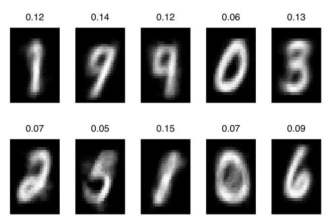

We fit a mixture of $K = {10}$ Bernoullis to the binarized MNIST digit data. We show the MLE for the corresponding cluster means, ${\mathbf{\mu }}_{k}$ . The numbers on top of each image represent the mixing weights ${\pi }_{k}$ . No labels were used when training the model.

## Parameter Estimation for Mixture Models: Unidentifiability

Definition of Unidentifiability:

## Parameter Estimation for Mixture Models: Unidentifiability

## Definition of Unidentifiability:

- Unidentifiability occurs when multiple parameter configurations in a mixture model lead to the same likelihood function value.

## Parameter Estimation for Mixture Models: Unidentifiability

## Definition of Unidentifiability:

- Unidentifiability occurs when multiple parameter configurations in a mixture model lead to the same likelihood function value.

- In other words, the model parameters cannot be uniquely determined from the observed data.

## Parameter Estimation for Mixture Models: Unidentifiability

## Definition of Unidentifiability:

- Unidentifiability occurs when multiple parameter configurations in a mixture model lead to the same likelihood function value.

- In other words, the model parameters cannot be uniquely determined from the observed data.

## Why Does It Happen?

## Parameter Estimation for Mixture Models: Unidentifiability

## Definition of Unidentifiability:

- Unidentifiability occurs when multiple parameter configurations in a mixture model lead to the same likelihood function value.

- In other words, the model parameters cannot be uniquely determined from the observed data.

## Why Does It Happen?

- Permutation Invariance: In a mixture model with $K$ components, the likelihood function is invariant under permutations of component labels. For example:

$\left( {{\pi }_{1},{\mathbf{\mu }}_{1},{\mathbf{\sum }}_{1}}\right) ,\left( {{\pi }_{2},{\mathbf{\mu }}_{2},{\mathbf{\sum }}_{2}}\right) \;$ is equivalent to $\;\left( {{\pi }_{2},{\mathbf{\mu }}_{2},{\mathbf{\sum }}_{2}}\right) ,\left( {{\pi }_{1},{\mathbf{\mu }}_{1},{\mathbf{\sum }}_{1}}\right)$ .

## Consequences

- This leads to $K$ ! equivalent global optima for the maximum likelihood estimation (MLE).

## Consequences

- This leads to $K$ ! equivalent global optima for the maximum likelihood estimation (MLE).

- We cannot confidently associate specific parameters (e.g., ${\mathbf{\mu }}_{k},{\mathbf{\sum }}_{k}$ ) with real-world subgroups.

## Consequences

- This leads to $K$ ! equivalent global optima for the maximum likelihood estimation (MLE).

- We cannot confidently associate specific parameters (e.g., ${\mathbf{\mu }}_{k},{\mathbf{\sum }}_{k}$ ) with real-world subgroups.

- Example: Suppose we have a height dataset without gender information

Consequences

## This leads to $K$ ! equivalent global optima for the maximum likelihood estimation (MLE).

We cannot confidently associate specific parameters (e.g., ${\mathbf{\mu }}_{k},{\mathbf{\sum }}_{k}$ ) with real-world subgroups.

- Example: Suppose we have a height dataset without gender information

- Based on trained GMM with $K = 2$ , it is difficult to distinguish which of the two Gaussian distributions represents males and which represents females.

Consequences

## This leads to $K$ ! equivalent global optima for the maximum likelihood estimation (MLE).

- We cannot confidently associate specific parameters (e.g., ${\mathbf{\mu }}_{k},{\mathbf{\sum }}_{k}$ ) with real-world subgroups.

- Example: Suppose we have a height dataset without gender information

- Based on trained GMM with $K = 2$ , it is difficult to distinguish which of the two Gaussian distributions represents males and which represents females.

Strategies to Mitigate Unidentifiability:

- Use Constraints:

- Impose constraints on the parameter space to ensure unique solutions (e.g., ordering the means ${\mathbf{\mu }}_{1} < {\mathbf{\mu }}_{2}$ ).

Consequences

## This leads to $K$ ! equivalent global optima for the maximum likelihood estimation (MLE).

We cannot confidently associate specific parameters (e.g., ${\mathbf{\mu }}_{k},{\mathbf{\sum }}_{k}$ ) with real-world subgroups.

- Example: Suppose we have a height dataset without gender information

- Based on trained GMM with $K = 2$ , it is difficult to distinguish which of the two Gaussian distributions represents males and which represents females.

Strategies to Mitigate Unidentifiability:

- Use Constraints:

- Impose constraints on the parameter space to ensure unique solutions (e.g., ordering the means ${\mathbf{\mu }}_{1} < {\mathbf{\mu }}_{2}$ ).

## D Post-hoc Label Alignment:

- After estimation, align the component labels with external knowledge or specific criteria.

## LVMs: Non-convex Optimization

- Suppose the joint probability distribution $p\left( {{x}_{i},{z}_{i} \mid  \theta }\right)$ is in the exponential family:

$$
p\left( {x, z \mid  \theta }\right)  = \frac{1}{C\left( \theta \right) }\exp \left\lbrack  {{\theta }^{\top }\phi \left( {x, z}\right) }\right\rbrack
$$

## LVMs: Non-convex Optimization

- Suppose the joint probability distribution $p\left( {{x}_{i},{z}_{i} \mid  \theta }\right)$ is in the exponential family:

$$
p\left( {x, z \mid  \theta }\right)  = \frac{1}{C\left( \theta \right) }\exp \left\lbrack  {{\theta }^{\top }\phi \left( {x, z}\right) }\right\rbrack
$$

- $\phi \left( {x, z}\right)$ is known

$C\left( \theta \right)$ : normalization constant, convex

## LVMs: Non-convex Optimization

- Suppose the joint probability distribution $p\left( {{x}_{i},{z}_{i} \mid  \theta }\right)$ is in the exponential family:

$$
p\left( {x, z \mid  \theta }\right)  = \frac{1}{C\left( \theta \right) }\exp \left\lbrack  {{\theta }^{\top }\phi \left( {x, z}\right) }\right\rbrack
$$

- $\phi \left( {x, z}\right)$ is known

$C\left( \theta \right)$ : normalization constant, convex

Complete data log likelihood: with ${\left\{  \left( {x}_{i},{z}_{i}\right) \right\}  }_{i = 1}^{N}$ ,

$$
{\ell }_{c}\left( \theta \right)  = \mathop{\sum }\limits_{i}\log p\left( {{x}_{i},{z}_{i} \mid  \theta }\right)  = {\theta }^{\top }\left\{  {\mathop{\sum }\limits_{i}\phi \left( {x, z}\right) }\right\}   - N \cdot  C\left( \theta \right)
$$

## LVMs: Non-convex Optimization

- Suppose the joint probability distribution $p\left( {{x}_{i},{z}_{i} \mid  \theta }\right)$ is in the exponential family:

$$
p\left( {x, z \mid  \theta }\right)  = \frac{1}{C\left( \theta \right) }\exp \left\lbrack  {{\theta }^{\top }\phi \left( {x, z}\right) }\right\rbrack
$$

- $\phi \left( {x, z}\right)$ is known

$C\left( \theta \right)$ : normalization constant, convex

Complete data log likelihood: with ${\left\{  \left( {x}_{i},{z}_{i}\right) \right\}  }_{i = 1}^{N}$ ,

$$
{\ell }_{c}\left( \theta \right)  = \mathop{\sum }\limits_{i}\log p\left( {{x}_{i},{z}_{i} \mid  \theta }\right)  = {\theta }^{\top }\left\{  {\mathop{\sum }\limits_{i}\phi \left( {x, z}\right) }\right\}   - N \cdot  C\left( \theta \right)
$$

- ${\ell }_{c}\left( \theta \right)$ is concave $\rightarrow$ unique maximum

LVMs: Non-convex Optimization

- Observed data log likelihood: with ${\left\{  {x}_{i}\right\}  }_{i = 1}^{N}$ ,

$$
\ell \left( \theta \right)  = \mathop{\sum }\limits_{i}\log p\left( {{x}_{i} \mid  \theta }\right)  = \mathop{\sum }\limits_{i}\log \left\{  {\mathop{\sum }\limits_{{z}_{i}}p\left( {{x}_{i},{z}_{i} \mid  \theta }\right) }\right\}
$$

$$
= \mathop{\sum }\limits_{i}\log \left\{  {\mathop{\sum }\limits_{{z}_{i}}\exp \left\lbrack  {{\theta }^{\top }\phi \left( {{x}_{i},{z}_{i}}\right) }\right\rbrack  }\right\}   - N \cdot  \log C\left( \theta \right) .
$$

LVMs: Non-convex Optimization

- Observed data log likelihood: with ${\left\{  {x}_{i}\right\}  }_{i = 1}^{N}$ ,

$$
\ell \left( \theta \right)  = \mathop{\sum }\limits_{i}\log p\left( {{x}_{i} \mid  \theta }\right)  = \mathop{\sum }\limits_{i}\log \left\{  {\mathop{\sum }\limits_{{z}_{i}}p\left( {{x}_{i},{z}_{i} \mid  \theta }\right) }\right\}
$$

$$
= \mathop{\sum }\limits_{i}\log \left\{  {\mathop{\sum }\limits_{{z}_{i}}\exp \left\lbrack  {{\theta }^{\top }\phi \left( {{x}_{i},{z}_{i}}\right) }\right\rbrack  }\right\}   - N \cdot  \log C\left( \theta \right) .
$$

> The log-sum-exp function is convex

## LVMs: Non-convex Optimization

- Observed data log likelihood: with ${\left\{  {x}_{i}\right\}  }_{i = 1}^{N}$ ,

$$
\ell \left( \theta \right)  = \mathop{\sum }\limits_{i}\log p\left( {{x}_{i} \mid  \theta }\right)  = \mathop{\sum }\limits_{i}\log \left\{  {\mathop{\sum }\limits_{{z}_{i}}p\left( {{x}_{i},{z}_{i} \mid  \theta }\right) }\right\}
$$

$$
= \mathop{\sum }\limits_{i}\log \left\{  {\mathop{\sum }\limits_{{z}_{i}}\exp \left\lbrack  {{\theta }^{\top }\phi \left( {{x}_{i},{z}_{i}}\right) }\right\rbrack  }\right\}   - N \cdot  \log C\left( \theta \right) .
$$

The log-sum-exp function is convex

The objective $\ell \left( \theta \right)$ is neither convex nor concave, and has local optima.

## Solution: EM algorithm

Goal: Maximizing the log likelihood of the observed data $\mathcal{D} = {\left\{  {x}_{i}\right\}  }_{i = 1}^{N}$ for LVMs:

$$
\ell \left( \theta \right)  = \mathop{\sum }\limits_{i}\log p\left( {{x}_{i} \mid  \theta }\right)  = \mathop{\sum }\limits_{i}\log \left\{  {\mathop{\sum }\limits_{{z}_{i}}p\left( {{x}_{i},{z}_{i} \mid  \theta }\right) }\right\}
$$

- The log cannot be pushed inside the sum

## Solution: EM algorithm

Goal: Maximizing the log likelihood of the observed data $\mathcal{D} = {\left\{  {x}_{i}\right\}  }_{i = 1}^{N}$ for LVMs:

$$
\ell \left( \theta \right)  = \mathop{\sum }\limits_{i}\log p\left( {{x}_{i} \mid  \theta }\right)  = \mathop{\sum }\limits_{i}\log \left\{  {\mathop{\sum }\limits_{{z}_{i}}p\left( {{x}_{i},{z}_{i} \mid  \theta }\right) }\right\}
$$

- The log cannot be pushed inside the sum

Basic idea:

- Define the complete data log likelihood ${\ell }_{c}\left( \theta \right)  = \mathop{\sum }\limits_{i}\log p\left( {{x}_{i},{z}_{i} \mid  \theta }\right)$

## Solution: EM algorithm

Goal: Maximizing the log likelihood of the observed data $\mathcal{D} = {\left\{  {x}_{i}\right\}  }_{i = 1}^{N}$ for LVMs:

$$
\ell \left( \theta \right)  = \mathop{\sum }\limits_{i}\log p\left( {{x}_{i} \mid  \theta }\right)  = \mathop{\sum }\limits_{i}\log \left\{  {\mathop{\sum }\limits_{{z}_{i}}p\left( {{x}_{i},{z}_{i} \mid  \theta }\right) }\right\}
$$

- The log cannot be pushed inside the sum

Basic idea:

- Define the complete data $\log$ likelihood ${\ell }_{c}\left( \theta \right)  = \mathop{\sum }\limits_{i}\log p\left( {{x}_{i},{z}_{i} \mid  \theta }\right)$

- E step: compute the expected complete data log likelihood

$$
Q\left( {\theta ,{\theta }^{\left( t - 1\right) }}\right)  = \mathbb{E}\left\lbrack  {{\ell }_{c}\left( \theta \right)  \mid  \mathcal{D},{\theta }^{\left( t - 1\right) }}\right\rbrack   = \mathop{\sum }\limits_{i}{\mathbb{E}}_{{z}_{i} \sim  p\left( {z \mid  {x}_{i},{\theta }^{\left( t - 1\right) }}\right) }\left\lbrack  {\log p\left( {{x}_{i},{z}_{i} \mid  \theta }\right) }\right\rbrack
$$

## Solution: EM algorithm

Goal: Maximizing the log likelihood of the observed data $\mathcal{D} = {\left\{  {x}_{i}\right\}  }_{i = 1}^{N}$ for LVMs:

$$
\ell \left( \theta \right)  = \mathop{\sum }\limits_{i}\log p\left( {{x}_{i} \mid  \theta }\right)  = \mathop{\sum }\limits_{i}\log \left\{  {\mathop{\sum }\limits_{{z}_{i}}p\left( {{x}_{i},{z}_{i} \mid  \theta }\right) }\right\}
$$

- The log cannot be pushed inside the sum

Basic idea:

- Define the complete data $\log$ likelihood ${\ell }_{c}\left( \theta \right)  = \mathop{\sum }\limits_{i}\log p\left( {{x}_{i},{z}_{i} \mid  \theta }\right)$

E step: compute the expected complete data log likelihood

$$
Q\left( {\theta ,{\theta }^{\left( t - 1\right) }}\right)  = \mathbb{E}\left\lbrack  {{\ell }_{c}\left( \theta \right)  \mid  \mathcal{D},{\theta }^{\left( t - 1\right) }}\right\rbrack   = \mathop{\sum }\limits_{i}{\mathbb{E}}_{{z}_{i} \sim  p\left( {z \mid  {x}_{i},{\theta }^{\left( t - 1\right) }}\right) }\left\lbrack  {\log p\left( {{x}_{i},{z}_{i} \mid  \theta }\right) }\right\rbrack
$$

- M step:

$$
{\theta }^{\left( t\right) } = \arg \mathop{\max }\limits_{\theta }Q\left( {\theta ,{\theta }^{\left( t - 1\right) }}\right)
$$

## Theoretical basis for EM

Goal: Maximizing the observed data log likelihood

$$
\ell \left( \theta \right)  = \mathop{\sum }\limits_{i}\log \left\{  {\mathop{\sum }\limits_{{z}_{i}}p\left( {{x}_{i},{z}_{i} \mid  \theta }\right) }\right\}
$$

## Theoretical basis for EM

Goal: Maximizing the observed data log likelihood

$$
\ell \left( \theta \right)  = \mathop{\sum }\limits_{i}\log \left\{  {\mathop{\sum }\limits_{{z}_{i}}p\left( {{x}_{i},{z}_{i} \mid  \theta }\right) }\right\}
$$

EM monotonically increases the observed data log likelihood until it reaches a local maximum!

## Theoretical basis for EM

Goal: Maximizing the observed data log likelihood

$$
\ell \left( \theta \right)  = \mathop{\sum }\limits_{i}\log \left\{  {\mathop{\sum }\limits_{{z}_{i}}p\left( {{x}_{i},{z}_{i} \mid  \theta }\right) }\right\}
$$

EM monotonically increases the observed data log likelihood until it reaches a local maximum!

Theoretical basis:

- Consider an arbitrary distribution $q\left( {z}_{i}\right)$ over the hidden variables.

## Theoretical basis for EM

Goal: Maximizing the observed data log likelihood

$$
\ell \left( \theta \right)  = \mathop{\sum }\limits_{i}\log \left\{  {\mathop{\sum }\limits_{{z}_{i}}p\left( {{x}_{i},{z}_{i} \mid  \theta }\right) }\right\}
$$

EM monotonically increases the observed data log likelihood until it reaches a local maximum!

Theoretical basis:

- Consider an arbitrary distribution $q\left( {z}_{i}\right)$ over the hidden variables.

The observed data log likelihood can be written as

$$
\ell \left( \theta \right)  = \mathop{\sum }\limits_{{i = 1}}^{N}\log \left\lbrack  {\mathop{\sum }\limits_{{z}_{i}}{q}_{i}\left( {z}_{i}\right) \frac{p\left( {{x}_{i},{z}_{i} \mid  \theta }\right) }{{q}_{i}\left( {z}_{i}\right) }}\right\rbrack   \geq  \mathop{\sum }\limits_{{i = 1}}^{N}\mathop{\sum }\limits_{{z}_{i}}{q}_{i}\left( {z}_{i}\right) \log \frac{p\left( {{x}_{i},{z}_{i} \mid  \theta }\right) }{{q}_{i}\left( {z}_{i}\right) }
$$

- $\log u$ is a concave function

- Jensen's inequality

## Theoretical basis for EM (cont’d)

- Denote this lower bound by

$$
\widetilde{Q}\left( {\theta , q}\right)  \mathrel{\text{ := }} \mathop{\sum }\limits_{{i = 1}}^{N}{\mathbb{E}}_{{z}_{i} \sim  {q}_{i}}\left\lbrack  {\log p\left( {{x}_{i},{z}_{i} \mid  \theta }\right) }\right\rbrack   + \mathop{\sum }\limits_{{i = 1}}^{N}\mathbb{H}\left( {q}_{i}\right)
$$

where $\mathbb{H}\left( {q}_{i}\right)$ is the entropy of ${q}_{i}$ .

## Theoretical basis for EM (cont’d)

- Denote this lower bound by

$$
\widetilde{Q}\left( {\theta , q}\right)  \mathrel{\text{ := }} \mathop{\sum }\limits_{{i = 1}}^{N}{\mathbb{E}}_{{z}_{i} \sim  {q}_{i}}\left\lbrack  {\log p\left( {{x}_{i},{z}_{i} \mid  \theta }\right) }\right\rbrack   + \mathop{\sum }\limits_{{i = 1}}^{N}\mathbb{H}\left( {q}_{i}\right)
$$

where $\mathbb{H}\left( {q}_{i}\right)$ is the entropy of ${q}_{i}$ .

Pick the $q$ ’s that yields the tightest lower bound:

## Theoretical basis for EM (cont'd)

- Denote this lower bound by

$$
\widetilde{Q}\left( {\theta , q}\right)  \mathrel{\text{ := }} \mathop{\sum }\limits_{{i = 1}}^{N}{\mathbb{E}}_{{z}_{i} \sim  {q}_{i}}\left\lbrack  {\log p\left( {{x}_{i},{z}_{i} \mid  \theta }\right) }\right\rbrack   + \mathop{\sum }\limits_{{i = 1}}^{N}\mathbb{H}\left( {q}_{i}\right)
$$

where $\mathbb{H}\left( {q}_{i}\right)$ is the entropy of ${q}_{i}$ .

- Pick the $q$ ’s that yields the tightest lower bound: the lower bound is a sum over $i$ of terms of the following form:

$$
{L}_{i}\left( {\theta ,{q}_{i}}\right)  = \mathop{\sum }\limits_{{z}_{i}}{q}_{i}\left( {z}_{i}\right) \log \frac{p\left( {{x}_{i},{z}_{i} \mid  \theta }\right) }{{q}_{i}\left( {z}_{i}\right) }
$$

$$
= \mathop{\sum }\limits_{{z}_{i}}{q}_{i}\left( {z}_{i}\right) \log \frac{p\left( {{z}_{i} \mid  {x}_{i},\theta }\right) p\left( {{x}_{i} \mid  \theta }\right) }{{q}_{i}\left( {z}_{i}\right) }
$$

$$
= \mathop{\sum }\limits_{{z}_{i}}{q}_{i}\left( {z}_{i}\right) \log \frac{p\left( {{z}_{i} \mid  {x}_{i},\theta }\right) }{{q}_{i}\left( {z}_{i}\right) } + \mathop{\sum }\limits_{{z}_{i}}{q}_{i}\left( {z}_{i}\right) \log p\left( {{x}_{i} \mid  \theta }\right)
$$

$$
=  - \mathrm{{KL}}\left( {{q}_{i}\left( {z}_{i}\right) \parallel p\left( {{z}_{i} \mid  {x}_{i},\theta }\right) }\right)  + \log p\left( {{x}_{i} \mid  \theta }\right)
$$

## Theoretical basis for EM (cont'd)

- Denote this lower bound by

$$
\widetilde{Q}\left( {\theta , q}\right)  \mathrel{\text{ := }} \mathop{\sum }\limits_{{i = 1}}^{N}{\mathbb{E}}_{{z}_{i} \sim  {q}_{i}}\left\lbrack  {\log p\left( {{x}_{i},{z}_{i} \mid  \theta }\right) }\right\rbrack   + \mathop{\sum }\limits_{{i = 1}}^{N}\mathbb{H}\left( {q}_{i}\right)
$$

where $\mathbb{H}\left( {q}_{i}\right)$ is the entropy of ${q}_{i}$ .

- Pick the $q$ ’s that yields the tightest lower bound: the lower bound is a sum over $i$ of terms of the following form:

$$
{L}_{i}\left( {\theta ,{q}_{i}}\right)  = \mathop{\sum }\limits_{{z}_{i}}{q}_{i}\left( {z}_{i}\right) \log \frac{p\left( {{x}_{i},{z}_{i} \mid  \theta }\right) }{{q}_{i}\left( {z}_{i}\right) }
$$

$$
= \mathop{\sum }\limits_{{z}_{i}}{q}_{i}\left( {z}_{i}\right) \log \frac{p\left( {{z}_{i} \mid  {x}_{i},\theta }\right) p\left( {{x}_{i} \mid  \theta }\right) }{{q}_{i}\left( {z}_{i}\right) }
$$

$$
= \mathop{\sum }\limits_{{z}_{i}}{q}_{i}\left( {z}_{i}\right) \log \frac{p\left( {{z}_{i} \mid  {x}_{i},\theta }\right) }{{q}_{i}\left( {z}_{i}\right) } + \mathop{\sum }\limits_{{z}_{i}}{q}_{i}\left( {z}_{i}\right) \log p\left( {{x}_{i} \mid  \theta }\right)
$$

$$
=  - \operatorname{KL}\left( {{q}_{i}\left( {z}_{i}\right) \parallel p\left( {{z}_{i} \mid  {x}_{i},\theta }\right) }\right)  + \log p\left( {{x}_{i} \mid  \theta }\right)
$$

- Maximize the lower bound by setting ${q}_{i}\left( {z}_{i}\right)  = p\left( {{z}_{i} \mid  {x}_{i},\theta }\right)$ .

## Theoretical basis for EM (cont’d)

- Since $\theta$ is unknown, so instead we use ${q}_{i}^{\left( t\right) }\left( {z}_{i}\right)  = p\left( {{z}_{i} \mid  {x}_{i},{\theta }^{\left( t\right) }}\right)$ . Plugging this into the lower bound, we get:

$$
\widetilde{Q}\left( {\theta ,{q}^{\left( t\right) }}\right)  = \mathop{\sum }\limits_{{i = 1}}^{N}{\mathbb{E}}_{{z}_{i} \sim  {q}_{i}^{\left( t\right) }}\left\lbrack  {\log p\left( {{x}_{i},{z}_{i} \mid  \theta }\right) }\right\rbrack   + \mathop{\sum }\limits_{{i = 1}}^{N}\mathbb{H}\left( {q}_{i}^{\left( t\right) }\right) .
$$

## Theoretical basis for EM (cont’d)

- Since $\theta$ is unknown, so instead we use ${q}_{i}^{\left( t\right) }\left( {z}_{i}\right)  = p\left( {{z}_{i} \mid  {x}_{i},{\theta }^{\left( t\right) }}\right)$ . Plugging this into the lower bound, we get:

$$
\widetilde{Q}\left( {\theta ,{q}^{\left( t\right) }}\right)  =
$$

$\mathop{\sum }\limits_{{i = 1}}^{N}{\mathbb{E}}_{{z}_{i} \sim  {q}_{i}^{\left( t\right) }}\left\lbrack  {\log p\left( {{x}_{i},{z}_{i} \mid  \theta }\right) }\right\rbrack$

expected complete data log likelihood in E step

Expected complete data log likelihood is a lower bound

## Theoretical basis for EM (cont’d)

- Since $\theta$ is unknown, so instead we use ${q}_{i}^{\left( t\right) }\left( {z}_{i}\right)  = p\left( {{z}_{i} \mid  {x}_{i},{\theta }^{\left( t\right) }}\right)$ . Plugging this into the lower bound, we get:

$\widetilde{Q}\left( {\theta ,{q}^{\left( t\right) }}\right)  =$

$\mathop{\sum }\limits_{{i = 1}}^{N}{\mathbb{E}}_{{z}_{i} \sim  {q}_{i}^{\left( t\right) }}\left\lbrack  {\log p\left( {{x}_{i},{z}_{i} \mid  \theta }\right) }\right\rbrack$

expected complete data log likelihood in E step

Expected complete data log likelihood is a lower bound

- Then, in M step,

$$
{\theta }^{\left( t + 1\right) } = \arg \mathop{\max }\limits_{\theta }\widetilde{Q}\left( {\theta ,{q}^{\left( t\right) }}\right)  = \arg \mathop{\max }\limits_{\theta }\mathop{\sum }\limits_{i}{\mathbb{E}}_{{z}_{i} \sim  {q}_{i}^{\left( t\right) }}\left\lbrack  {\log p\left( {{x}_{i},{z}_{i} \mid  \theta }\right) }\right\rbrack
$$

## Theoretical basis for EM (cont’d)

$$
\widetilde{Q}\left( {\theta , q}\right)  = \mathop{\sum }\limits_{i}{L}_{i}\left( {\theta ,{q}_{i}}\right)
$$

$$
{L}_{i}\left( {\theta ,{q}_{i}}\right)  =  - \mathrm{{KL}}\left( {{q}_{i}\left( {z}_{i}\right) \parallel p\left( {{z}_{i} \mid  {x}_{i},\theta }\right) }\right)  + \log p\left( {{x}_{i} \mid  \theta }\right)
$$

Goal: Maximizing the observed data log likelihood

$$
\ell \left( \theta \right)  = \mathop{\sum }\limits_{i}\log \left\{  {\mathop{\sum }\limits_{{z}_{i}}p\left( {{x}_{i},{z}_{i} \mid  \theta }\right) }\right\}
$$

## Theoretical basis for EM (cont’d)

$$
\widetilde{Q}\left( {\theta , q}\right)  = \mathop{\sum }\limits_{i}{L}_{i}\left( {\theta ,{q}_{i}}\right)
$$

$$
{L}_{i}\left( {\theta ,{q}_{i}}\right)  =  - \mathrm{{KL}}\left( {{q}_{i}\left( {z}_{i}\right) \parallel p\left( {{z}_{i} \mid  {x}_{i},\theta }\right) }\right)  + \log p\left( {{x}_{i} \mid  \theta }\right)
$$

Goal: Maximizing the observed data log likelihood

$$
\ell \left( \theta \right)  = \mathop{\sum }\limits_{i}\log \left\{  {\mathop{\sum }\limits_{{z}_{i}}p\left( {{x}_{i},{z}_{i} \mid  \theta }\right) }\right\}
$$

Since we used ${q}_{i}^{\left( t\right) }\left( {z}_{i}\right)  = p\left( {{z}_{i} \mid  {x}_{i},{\theta }^{\left( t\right) }}\right)$ , the KL divergence becomes zero, so ${L}_{i}\left( {{\theta }^{\left( t\right) },{q}_{i}^{\left( t\right) }}\right)  = \log p\left( {{x}_{i} \mid  {\theta }^{\left( t\right) }}\right)$ ,

## Theoretical basis for EM (cont'd)

$$
\widetilde{Q}\left( {\theta , q}\right)  = \mathop{\sum }\limits_{i}{L}_{i}\left( {\theta ,{q}_{i}}\right)
$$

$$
{L}_{i}\left( {\theta ,{q}_{i}}\right)  =  - \mathrm{{KL}}\left( {{q}_{i}\left( {z}_{i}\right) \parallel p\left( {{z}_{i} \mid  {x}_{i},\theta }\right) }\right)  + \log p\left( {{x}_{i} \mid  \theta }\right)
$$

Goal: Maximizing the observed data log likelihood

$$
\ell \left( \theta \right)  = \mathop{\sum }\limits_{i}\log \left\{  {\mathop{\sum }\limits_{{z}_{i}}p\left( {{x}_{i},{z}_{i} \mid  \theta }\right) }\right\}
$$

- Since we used ${q}_{i}^{\left( t\right) }\left( {z}_{i}\right)  = p\left( {{z}_{i} \mid  {x}_{i},{\theta }^{\left( t\right) }}\right)$ , the KL divergence becomes zero, so ${L}_{i}\left( {{\theta }^{\left( t\right) },{q}_{i}^{\left( t\right) }}\right)  = \log p\left( {{x}_{i} \mid  {\theta }^{\left( t\right) }}\right)$ , and hence:

$$
\widetilde{Q}\left( {{\theta }^{\left( t\right) },{q}^{\left( t\right) }}\right)  = \mathop{\sum }\limits_{i}{L}_{i}\left( {{\theta }^{\left( t\right) },{q}_{i}^{\left( t\right) }}\right)  = \mathop{\sum }\limits_{i}\log p\left( {{x}_{i} \mid  {\theta }^{\left( t\right) }}\right)  = \ell \left( {\theta }^{\left( t\right) }\right)
$$

## Theoretical basis for EM (cont’d)

$$
\widetilde{Q}\left( {\theta , q}\right)  = \mathop{\sum }\limits_{i}{L}_{i}\left( {\theta ,{q}_{i}}\right)
$$

$$
{L}_{i}\left( {\theta ,{q}_{i}}\right)  =  - \mathrm{{KL}}\left( {{q}_{i}\left( {z}_{i}\right) \parallel p\left( {{z}_{i} \mid  {x}_{i},\theta }\right) }\right)  + \log p\left( {{x}_{i} \mid  \theta }\right)
$$

Goal: Maximizing the observed data log likelihood

$$
\ell \left( \theta \right)  = \mathop{\sum }\limits_{i}\log \left\{  {\mathop{\sum }\limits_{{z}_{i}}p\left( {{x}_{i},{z}_{i} \mid  \theta }\right) }\right\}
$$

Since we used ${q}_{i}^{\left( t\right) }\left( {z}_{i}\right)  = p\left( {{z}_{i} \mid  {x}_{i},{\theta }^{\left( t\right) }}\right)$ , the KL divergence becomes zero, so ${L}_{i}\left( {{\theta }^{\left( t\right) },{q}_{i}^{\left( t\right) }}\right)  = \log p\left( {{x}_{i} \mid  {\theta }^{\left( t\right) }}\right)$ , and hence:

$$
\widetilde{Q}\left( {{\theta }^{\left( t\right) },{q}^{\left( t\right) }}\right)  = \mathop{\sum }\limits_{i}{L}_{i}\left( {{\theta }^{\left( t\right) },{q}_{i}^{\left( t\right) }}\right)  = \mathop{\sum }\limits_{i}\log p\left( {{x}_{i} \mid  {\theta }^{\left( t\right) }}\right)  = \ell \left( {\theta }^{\left( t\right) }\right)
$$

EM monotonically increases the observed data log likelihood:

$$
\ell \left( {\theta }^{\left( t\right) }\right)  = \widetilde{Q}\left( {{\theta }^{\left( t\right) },{q}^{\left( t\right) }}\right) \overset{\text{ M step }}{ \leq  }\widetilde{Q}\left( {{\theta }^{\left( t + 1\right) },{q}^{\left( t\right) }}\right)
$$

$$
\overset{\text{ Definition of }\widetilde{Q}}{ \leq  }\widetilde{Q}\left( {{\theta }^{\left( t + 1\right) },{q}^{\left( t + 1\right) }}\right)  = \ell \left( {\theta }^{\left( t + 1\right) }\right)
$$

## EM for GMMs

GMMs: the marginal density function of $X$ is

$$
p\left( {\mathbf{x} \mid  \theta }\right)  = \mathop{\sum }\limits_{{k = 1}}^{K}{\pi }_{k} \cdot  p\left( {\mathbf{x} \mid  {\mathbf{\mu }}_{k},{\mathbf{\sum }}_{k}}\right) ,
$$

where

$$
p\left( {\mathbf{x} \mid  {\mathbf{\mu }}_{k},{\mathbf{\sum }}_{k}}\right)  = \frac{1}{{\left( 2\pi \right) }^{d/2}{\left| {\mathbf{\sum }}_{k}\right| }^{1/2}}\exp \left( {-\frac{1}{2}{\left( \mathbf{x} - {\mathbf{\mu }}_{k}\right) }^{\top }{\mathbf{\sum }}_{k}^{-1}\left( {\mathbf{x} - {\mathbf{\mu }}_{k}}\right) }\right) .
$$

## EM for GMMs

GMMs: the marginal density function of $X$ is

$$
p\left( {\mathbf{x} \mid  \theta }\right)  = \mathop{\sum }\limits_{{k = 1}}^{K}{\pi }_{k} \cdot  p\left( {\mathbf{x} \mid  {\mathbf{\mu }}_{k},{\mathbf{\sum }}_{k}}\right) ,
$$

where

$$
p\left( {\mathbf{x} \mid  {\mathbf{\mu }}_{k},{\mathbf{\sum }}_{k}}\right)  = \frac{1}{{\left( 2\pi \right) }^{d/2}{\left| {\mathbf{\sum }}_{k}\right| }^{1/2}}\exp \left( {-\frac{1}{2}{\left( \mathbf{x} - {\mathbf{\mu }}_{k}\right) }^{\top }{\mathbf{\sum }}_{k}^{-1}\left( {\mathbf{x} - {\mathbf{\mu }}_{k}}\right) }\right) .
$$

- Assume the number of mixture components, $K$ , is known (Selection of $K$ )

## EM for GMMs

- GMMs: the marginal density function of $X$ is

$$
p\left( {\mathbf{x} \mid  \theta }\right)  = \mathop{\sum }\limits_{{k = 1}}^{K}{\pi }_{k} \cdot  p\left( {\mathbf{x} \mid  {\mathbf{\mu }}_{k},{\mathbf{\sum }}_{k}}\right) ,
$$

where

$$
p\left( {\mathbf{x} \mid  {\mathbf{\mu }}_{k},{\mathbf{\sum }}_{k}}\right)  = \frac{1}{{\left( 2\pi \right) }^{d/2}{\left| {\mathbf{\sum }}_{k}\right| }^{1/2}}\exp \left( {-\frac{1}{2}{\left( \mathbf{x} - {\mathbf{\mu }}_{k}\right) }^{\top }{\mathbf{\sum }}_{k}^{-1}\left( {\mathbf{x} - {\mathbf{\mu }}_{k}}\right) }\right) .
$$

- Assume the number of mixture components, $K$ , is known (Selection of $K$ )

The parameters ${\theta }_{k} = \left( {{\mathbf{\mu }}_{k},{\mathbf{\sum }}_{k}}\right)$ and ${\pi }_{k}$ for $k = 1,\ldots , K$ are unknown and define $\theta  = {\left\{  {\theta }_{k},{\pi }_{k}\right\}  }_{k = 1}^{K}$

## EM for GMMs

S GMMs: the marginal density function of $X$ is

$$
p\left( {\mathbf{x} \mid  \theta }\right)  = \mathop{\sum }\limits_{{k = 1}}^{K}{\pi }_{k} \cdot  p\left( {\mathbf{x} \mid  {\mathbf{\mu }}_{k},{\mathbf{\sum }}_{k}}\right) ,
$$

where

$$
p\left( {\mathbf{x} \mid  {\mathbf{\mu }}_{k},{\mathbf{\sum }}_{k}}\right)  = \frac{1}{{\left( 2\pi \right) }^{d/2}{\left| {\mathbf{\sum }}_{k}\right| }^{1/2}}\exp \left( {-\frac{1}{2}{\left( \mathbf{x} - {\mathbf{\mu }}_{k}\right) }^{\top }{\mathbf{\sum }}_{k}^{-1}\left( {\mathbf{x} - {\mathbf{\mu }}_{k}}\right) }\right) .
$$

- Assume the number of mixture components, $K$ , is known (Selection of $K$ )

The parameters ${\theta }_{k} = \left( {{\mathbf{\mu }}_{k},{\mathbf{\sum }}_{k}}\right)$ and ${\pi }_{k}$ for $k = 1,\ldots , K$ are unknown and define $\theta  = {\left\{  {\theta }_{k},{\pi }_{k}\right\}  }_{k = 1}^{K}$

> The joint density function is

$$
p\left( {\mathbf{x}, z \mid  \theta }\right)  = {\Pi }_{k = 1}^{K}{\left\{  {\pi }_{k}p\left( \mathbf{x} \mid  {\theta }_{k}\right) \right\}  }^{I\left( {z = k}\right) }
$$

## EM for GMMs

- E step of EM algorithm: compute the expected complete data log likelihood $Q\left( {\theta ,{\theta }^{\left( t - 1\right) }}\right)  = \mathop{\sum }\limits_{i}{\mathbb{E}}_{{z}_{i} \sim  p\left( {z|{x}_{i},{\theta }^{\left( t - 1\right) }}\right) }\left\lbrack  {\log p\left( {{x}_{i},{z}_{i}|\theta }\right) }\right\rbrack$

- M step of EM algorithm: ${\theta }^{\left( t\right) } = \arg \mathop{\max }\limits_{\theta }Q\left( {\theta ,{\theta }^{\left( t - 1\right) }}\right)$

## EM for GMMs

- E step of EM algorithm: compute the expected complete data log likelihood $Q\left( {\theta ,{\theta }^{\left( t - 1\right) }}\right)  = \mathop{\sum }\limits_{i}{\mathbb{E}}_{{z}_{i} \sim  p\left( {z \mid  {x}_{i},{\theta }^{\left( t - 1\right) }}\right) }\left\lbrack  {\log p\left( {{x}_{i},{z}_{i} \mid  \theta }\right) }\right\rbrack$

- M step of EM algorithm: ${\theta }^{\left( t\right) } = \arg \mathop{\max }\limits_{\theta }Q\left( {\theta ,{\theta }^{\left( t - 1\right) }}\right)$

- For GMM, the expected complete data log likelihood is given by

$$
Q\left( {\theta ,{\theta }^{\left( t - 1\right) }}\right)  = \mathop{\sum }\limits_{i}{\mathbb{E}}_{{z}_{i} \sim  p\left( {z \mid  {\mathbf{x}}_{i},{\theta }^{\left( t - 1\right) }}\right) }\left\lbrack  {\log p\left( {{\mathbf{x}}_{i},{z}_{i} \mid  \theta }\right) }\right\rbrack
$$

$$
= \mathop{\sum }\limits_{i}{\mathbb{E}}_{{z}_{i} \sim  p\left( {z \mid  {\mathbf{x}}_{i},{\theta }^{\left( t - 1\right) }}\right) }\left\lbrack  {\log \left( {\mathop{\prod }\limits_{{k = 1}}^{K}{\left( {\pi }_{k}p\left( {\mathbf{x}}_{i} \mid  {\theta }_{k}\right) \right) }^{\mathbb{I}\left( {{z}_{i} = k}\right) }}\right) }\right\rbrack
$$

$$
= \mathop{\sum }\limits_{i}\mathop{\sum }\limits_{k}{\mathbb{E}}_{{z}_{i} \sim  p\left( {z \mid  {\mathbf{x}}_{i},{\theta }^{\left( t - 1\right) }}\right) }\left\lbrack  {\mathbb{I}\left( {{z}_{i} = k}\right) }\right\rbrack  \log \left( {{\pi }_{k}p\left( {{\mathbf{x}}_{i} \mid  {\theta }_{k}}\right) }\right)
$$

$$
= \mathop{\sum }\limits_{i}\mathop{\sum }\limits_{k}p\left( {{z}_{i} = k \mid  {\mathbf{x}}_{i},{\theta }^{\left( t - 1\right) }}\right) \log \left( {{\pi }_{k}p\left( {{\mathbf{x}}_{i} \mid  {\theta }_{k}}\right) }\right)
$$

$$
= \mathop{\sum }\limits_{i}\mathop{\sum }\limits_{k}{r}_{ik}\log {\pi }_{k} + \mathop{\sum }\limits_{i}\mathop{\sum }\limits_{k}{r}_{ik}\log p\left( {{\mathbf{x}}_{i} \mid  {\theta }_{k}}\right)
$$

where ${r}_{ik} \mathrel{\text{ := }} p\left( {{z}_{i} = k \mid  {\mathbf{x}}_{i},{\theta }^{\left( t - 1\right) }}\right)$ is the responsibility that cluster $k$ takes for data point $i$ .

EM for GMMs (cont’d)

- E step: by Bayes rule,

$$
{r}_{ik} = \frac{p\left( {{z}_{i} = k \mid  {\pi }_{k}^{\left( t - 1\right) }}\right) p\left( {{\mathbf{x}}_{i} \mid  {\theta }_{k}^{\left( t - 1\right) }}\right) }{\mathop{\sum }\limits_{{k}^{\prime }}p\left( {{z}_{i} = {k}^{\prime } \mid  {\pi }_{k}^{\left( t - 1\right) }}\right) p\left( {{\mathbf{x}}_{i} \mid  {\theta }_{{k}^{\prime }}^{\left( t - 1\right) }}\right) } = \frac{{\pi }_{k}^{\left( t - 1\right) }p\left( {{\mathbf{x}}_{i} \mid  {\theta }_{k}^{\left( t - 1\right) }}\right) }{\mathop{\sum }\limits_{{k}^{\prime }}{\pi }_{{k}^{\prime }}^{\left( t - 1\right) }p\left( {{\mathbf{x}}_{i} \mid  {\theta }_{{k}^{\prime }}^{\left( t - 1\right) }}\right) }.
$$

## EM for GMMs (cont’d)

- E step: by Bayes rule,

$$
{r}_{ik} = \frac{p\left( {{z}_{i} = k \mid  {\pi }_{k}^{\left( t - 1\right) }}\right) p\left( {{\mathbf{x}}_{i} \mid  {\theta }_{k}^{\left( t - 1\right) }}\right) }{\mathop{\sum }\limits_{{k}^{\prime }}p\left( {{z}_{i} = {k}^{\prime } \mid  {\pi }_{k}^{\left( t - 1\right) }}\right) p\left( {{\mathbf{x}}_{i} \mid  {\theta }_{{k}^{\prime }}^{\left( t - 1\right) }}\right) } = \frac{{\pi }_{k}^{\left( t - 1\right) }p\left( {{\mathbf{x}}_{i} \mid  {\theta }_{k}^{\left( t - 1\right) }}\right) }{\mathop{\sum }\limits_{{k}^{\prime }}{\pi }_{{k}^{\prime }}^{\left( t - 1\right) }p\left( {{\mathbf{x}}_{i} \mid  {\theta }_{{k}^{\prime }}^{\left( t - 1\right) }}\right) }.
$$

- Note that

$$
Q\left( {\theta ,{\theta }^{\left( t - 1\right) }}\right)  = \underset{\text{ Only depends on }{\pi }_{k}}{\underbrace{\mathop{\sum }\limits_{i}\mathop{\sum }\limits_{k}{r}_{ik}\log {\pi }_{k}}} + \mathop{\sum }\limits_{i}\mathop{\sum }\limits_{k}{r}_{ik}\log p\left( {{\mathbf{x}}_{i} \mid  {\theta }_{k}}\right)
$$

## EM for GMMs (cont’d)

- E step: by Bayes rule,

$$
{r}_{ik} = \frac{p\left( {{z}_{i} = k \mid  {\pi }_{k}^{\left( t - 1\right) }}\right) p\left( {{\mathbf{x}}_{i} \mid  {\theta }_{k}^{\left( t - 1\right) }}\right) }{\mathop{\sum }\limits_{{k}^{\prime }}p\left( {{z}_{i} = {k}^{\prime } \mid  {\pi }_{k}^{\left( t - 1\right) }}\right) p\left( {{\mathbf{x}}_{i} \mid  {\theta }_{{k}^{\prime }}^{\left( t - 1\right) }}\right) } = \frac{{\pi }_{k}^{\left( t - 1\right) }p\left( {{\mathbf{x}}_{i} \mid  {\theta }_{k}^{\left( t - 1\right) }}\right) }{\mathop{\sum }\limits_{{k}^{\prime }}{\pi }_{{k}^{\prime }}^{\left( t - 1\right) }p\left( {{\mathbf{x}}_{i} \mid  {\theta }_{{k}^{\prime }}^{\left( t - 1\right) }}\right) }.
$$

- Note that

$$
Q\left( {\theta ,{\theta }^{\left( t - 1\right) }}\right)  = \mathop{\sum }\limits_{i}\mathop{\sum }\limits_{k}{r}_{ik}\log {\pi }_{k} + \underset{\text{ Only depends on }}{\underbrace{\mathop{\sum }\limits_{i}\mathop{\sum }\limits_{k}{r}_{ik}\log p\left( {{\mathbf{x}}_{i} \mid  {\theta }_{k}}\right) }}
$$

- M step: We optimize $Q$ with respect to ${\pi }_{k}$ and the ${\theta }_{k}$ .

$$
{\pi }_{k}^{\left( t\right) } = \frac{1}{N}\mathop{\sum }\limits_{i}{r}_{ik} = \frac{{r}_{k}}{N}
$$

where ${r}_{k} = \mathop{\sum }\limits_{i}{r}_{ik}$ is the weighted number of points assigned to cluster $k$ .

## EM for GMMs (cont’d)

- E step: by Bayes rule,

$$
{r}_{ik} = \frac{p\left( {{z}_{i} = k \mid  {\pi }_{k}^{\left( t - 1\right) }}\right) p\left( {{\mathbf{x}}_{i} \mid  {\theta }_{k}^{\left( t - 1\right) }}\right) }{\mathop{\sum }\limits_{{k}^{\prime }}p\left( {{z}_{i} = {k}^{\prime } \mid  {\pi }_{k}^{\left( t - 1\right) }}\right) p\left( {{\mathbf{x}}_{i} \mid  {\theta }_{{k}^{\prime }}^{\left( t - 1\right) }}\right) } = \frac{{\pi }_{k}^{\left( t - 1\right) }p\left( {{\mathbf{x}}_{i} \mid  {\theta }_{k}^{\left( t - 1\right) }}\right) }{\mathop{\sum }\limits_{{k}^{\prime }}{\pi }_{{k}^{\prime }}^{\left( t - 1\right) }p\left( {{\mathbf{x}}_{i} \mid  {\theta }_{{k}^{\prime }}^{\left( t - 1\right) }}\right) }.
$$

- Note that

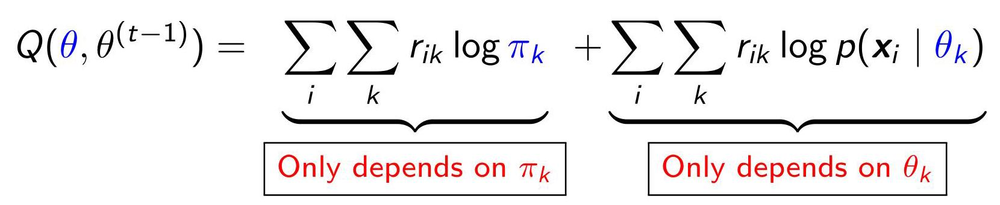

- M step: We optimize $Q$ with respect to ${\pi }_{k}$ and the ${\theta }_{k}$ .

$$
{\pi }_{k}^{\left( t\right) } = \frac{1}{N}\mathop{\sum }\limits_{i}{r}_{ik} = \frac{{r}_{k}}{N}
$$

where ${r}_{k} = \mathop{\sum }\limits_{i}{r}_{ik}$ is the weighted number of points assigned to cluster $k$ .

EM for GMMs (cont’d)

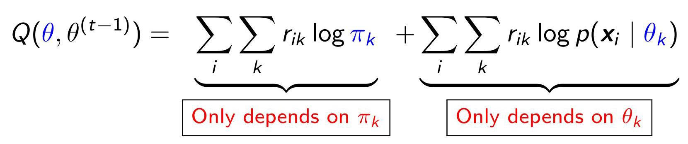

EM for GMMs (cont’d)

- M step: for the ${\mathbf{\mu }}_{k}$ and ${\mathbf{\sum }}_{k}$ terms,

$$
\ell \left( {{\mathbf{\mu }}_{k},{\mathbf{\sum }}_{k}}\right)  = \mathop{\sum }\limits_{i}{r}_{ik}\log p\left( {{\mathbf{x}}_{i} \mid  {\theta }_{k}}\right)
$$

$$
=  - \frac{1}{2}\mathop{\sum }\limits_{i}{r}_{ik}\left\lbrack  {\log \left| {\mathbf{\sum }}_{k}\right|  + {\left( {\mathbf{x}}_{i} - {\mathbf{\mu }}_{k}\right) }^{\top }{\mathbf{\sum }}_{k}^{-1}\left( {{\mathbf{x}}_{i} - {\mathbf{\mu }}_{k}}\right) }\right\rbrack  .
$$

EM for GMMs (cont’d)

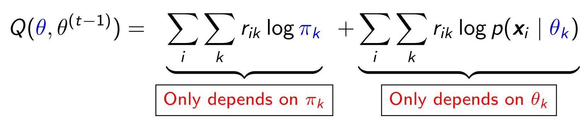

- M step: for the ${\mathbf{\mu }}_{k}$ and ${\mathbf{\sum }}_{k}$ terms,

$$
\ell \left( {{\mathbf{\mu }}_{k},{\mathbf{\sum }}_{k}}\right)  = \mathop{\sum }\limits_{i}{r}_{ik}\log p\left( {{\mathbf{x}}_{i} \mid  {\theta }_{k}}\right)
$$

$$
=  - \frac{1}{2}\mathop{\sum }\limits_{i}{r}_{ik}\left\lbrack  {\log \left| {\mathbf{\sum }}_{k}\right|  + {\left( {\mathbf{x}}_{i} - {\mathbf{\mu }}_{k}\right) }^{\top }{\mathbf{\sum }}_{k}^{-1}\left( {{\mathbf{x}}_{i} - {\mathbf{\mu }}_{k}}\right) }\right\rbrack  .
$$

Thus, inspired by MLE for multivariate normal distribution, we get

$$
{\mathbf{\mu }}_{k}^{\left( t\right) } = \frac{\mathop{\sum }\limits_{i}{r}_{ik}{\mathbf{x}}_{i}}{{r}_{k}}
$$

$$
{\mathbf{\sum }}_{k}^{\left( t\right) } = \frac{\mathop{\sum }\limits_{i}{r}_{ik}\left( {{\mathbf{x}}_{i} - {\mathbf{\mu }}_{k}^{\left( t\right) }}\right) {\left( {\mathbf{x}}_{i} - {\mathbf{\mu }}_{k}^{\left( t\right) }\right) }^{T}}{{r}_{k}} = \frac{\mathop{\sum }\limits_{i}{r}_{ik}{\mathbf{x}}_{i}{\mathbf{x}}_{i}^{T}}{{r}_{k}} - {\mathbf{\mu }}_{k}^{\left( t\right) }{{\mathbf{\mu }}_{k}^{\left( t\right) }}^{\top }.
$$

## Example: The Old Faithful data set

### A.7 The Old Faithful data set

The Old Faithful data set contains the waiting time between eruptions and the duration of the eruption for the Old Faithful geyser in Yellowstone National Park, Wyoming, USA (Fig. A.7). The two variables are:

- The variable eruptions contains the eruption time (in minutes). Unusually, the histogram is bimodal.

- The variable waiting is the waiting time (in minutes) until the next eruption. Unusually, the histogram is bimodal.

To download: Click here

<table><tr><td>To nominal, CILL IICIC</td><td></td><td></td></tr><tr><td>Show entries</td><td></td><td></td></tr><tr><td></td><td>Eruption time</td><td>Waiting time</td></tr><tr><td>1</td><td>3.6</td><td>79</td></tr><tr><td>2</td><td>1.8</td><td>54</td></tr><tr><td>3</td><td>3.333</td><td>74</td></tr><tr><td colspan="2">4 2.283</td><td>62</td></tr><tr><td colspan="2">5 4.533</td><td>85</td></tr><tr><td colspan="2">6 2.883</td><td>55</td></tr><tr><td>7</td><td>4.7</td><td>88</td></tr><tr><td>8</td><td>3.6</td><td>85</td></tr><tr><td>9</td><td>1.95</td><td>51</td></tr><tr><td>10</td><td>4.35</td><td>85</td></tr></table>

## Example: The Old Faithful data set (cont'd)

- The data was standardized, by removing the mean and dividing by the standard deviation, before processing. This often helps convergence.

## Example: The Old Faithful data set (cont’d)

- The data was standardized, by removing the mean and dividing by the standard deviation, before processing. This often helps convergence.

- We start with ${\mathbf{\mu }}_{1} = \left( {-1,1}\right) ,{\mathbf{\sum }}_{1} = {I}_{d}$ , and ${\mathbf{\mu }}_{2} = \left( {1, - 1}\right) ,{\mathbf{\sum }}_{2} = {I}_{d}$

We color code points such that blue points come from cluster 1 and red points from cluster 2.

- Set the color for $i$ -th data point to $\operatorname{color}\left( i\right)  = {r}_{i1}$ blue $+ {r}_{i2}$ red

Ambiguous points appear purple ${r}_{i1} \approx  {r}_{i2} \approx  {0.5}$ .

Example: The Old Faithful data set(cont’d)

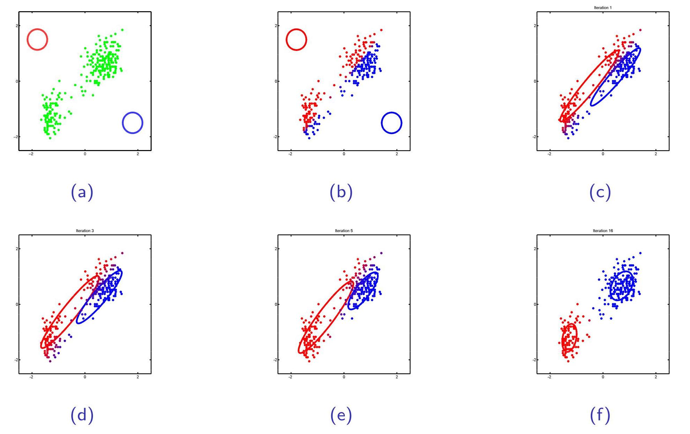

Figure: (a)Initial (random) values of the parameters. (b)Posterior responsibility ${r}_{ik}$ of each point computed in the first $E$ step. (c)The updated parameters after the first M step. (d)After 3 iterations. (e)After 5 iterations. (f)After 16 iterations.

Question

Why Gaussian Mixture Models Are So Popular?

Variants of EM Algorithm for GMMs

EM Algorithm for GMMs

- E step: Compute the responsibility that cluster $k$ takes for data point $i : {r}_{ik} \mathrel{\text{ := }} p\left( {{z}_{i} = k \mid  {\mathbf{x}}_{i},{\theta }^{\left( t - 1\right) }}\right)$

## Variants of EM Algorithm for GMMs

EM Algorithm for GMMs

- E step: Compute the responsibility that cluster $k$ takes for data point $i : {r}_{ik} \mathrel{\text{ := }} p\left( {{z}_{i} = k \mid  {\mathbf{x}}_{i},{\theta }^{\left( t - 1\right) }}\right)$

- M step: Update

$$
{\pi }_{k}^{\left( t\right) } = \frac{1}{N}\mathop{\sum }\limits_{i}{r}_{ik} = \frac{{r}_{k}}{N},\;{\mathbf{\mu }}_{k}^{\left( t\right) } = \frac{\mathop{\sum }\limits_{i}{r}_{ik}{\mathbf{x}}_{i}}{{r}_{k}}
$$

$$
{\mathbf{\sum }}_{k}^{\left( t\right) } = \frac{\mathop{\sum }\limits_{i}{r}_{ik}{\mathbf{x}}_{i}{\mathbf{x}}_{i}^{T}}{{r}_{k}} - {\mathbf{\mu }}_{k}^{\left( t\right) }{{\mathbf{\mu }}_{k}^{\left( t\right) }}^{\top }.
$$

## Variants of EM Algorithm for GMMs

EM Algorithm for GMMs

- E step: Compute the responsibility that cluster $k$ takes for data point $i : {r}_{ik} \mathrel{\text{ := }} p\left( {{z}_{i} = k \mid  {\mathbf{x}}_{i},{\theta }^{\left( t - 1\right) }}\right)$

- M step: Update

$$
{\pi }_{k}^{\left( t\right) } = \frac{1}{N}\mathop{\sum }\limits_{i}{r}_{ik} = \frac{{r}_{k}}{N},\;{\mathbf{\mu }}_{k}^{\left( t\right) } = \frac{\mathop{\sum }\limits_{i}{r}_{ik}{\mathbf{x}}_{i}}{{r}_{k}}
$$

$$
{\mathbf{\sum }}_{k}^{\left( t\right) } = \frac{\mathop{\sum }\limits_{i}{r}_{ik}{\mathbf{x}}_{i}{\mathbf{x}}_{i}^{\top }}{{r}_{k}} - {\mathbf{\mu }}_{k}^{\left( t\right) }{{\mathbf{\mu }}_{k}^{\left( t\right) }}^{\top }.
$$

K-means Algorithm:

## Variants of EM Algorithm for GMMs

EM Algorithm for GMMs

- E step: Compute the responsibility that cluster $k$ takes for data point $i : {r}_{ik} \mathrel{\text{ := }} p\left( {{z}_{i} = k \mid  {\mathbf{x}}_{i},{\theta }^{\left( t - 1\right) }}\right)$

- M step: Update

$$
{\pi }_{k}^{\left( t\right) } = \frac{1}{N}\mathop{\sum }\limits_{i}{r}_{ik} = \frac{{r}_{k}}{N},\;{\mathbf{\mu }}_{k}^{\left( t\right) } = \frac{\mathop{\sum }\limits_{i}{r}_{ik}{\mathbf{x}}_{i}}{{r}_{k}}
$$

$$
{\mathbf{\sum }}_{k}^{\left( t\right) } = \frac{\mathop{\sum }\limits_{i}{r}_{ik}{\mathbf{x}}_{i}{\mathbf{x}}_{i}^{\top }}{{r}_{k}} - {\mathbf{\mu }}_{k}^{\left( t\right) }{{\mathbf{\mu }}_{k}^{\left( t\right) }}^{\top }.
$$

## K-means Algorithm:

- Consider a GMM: ${\mathbf{\sum }}_{k} = {\sigma }^{2}{I}_{d}$ is fixed, and ${\pi }_{k} = 1/K$ is fixed, so only the cluster centers, ${\mathbf{\mu }}_{k}$ have to be estimated.

## Variants of EM Algorithm for GMMs

EM Algorithm for GMMs

- E step: Compute the responsibility that cluster $k$ takes for data point $i : {r}_{ik} \mathrel{\text{ := }} p\left( {{z}_{i} = k \mid  {\mathbf{x}}_{i},{\theta }^{\left( t - 1\right) }}\right)$

- M step: Update

$$
{\pi }_{k}^{\left( t\right) } = \frac{1}{N}\mathop{\sum }\limits_{i}{r}_{ik} = \frac{{r}_{k}}{N},\;{\mathbf{\mu }}_{k}^{\left( t\right) } = \frac{\mathop{\sum }\limits_{i}{r}_{ik}{\mathbf{x}}_{i}}{{r}_{k}}
$$

$$
{\mathbf{\sum }}_{k}^{\left( t\right) } = \frac{\mathop{\sum }\limits_{i}{r}_{ik}{\mathbf{x}}_{i}{\mathbf{x}}_{i}^{T}}{{r}_{k}} - {\mathbf{\mu }}_{k}^{\left( t\right) }{{\mathbf{\mu }}_{k}^{\left( t\right) }}^{\top }.
$$

## K-means Algorithm:

- Consider a GMM: ${\mathbf{\sum }}_{k} = {\sigma }^{2}{I}_{d}$ is fixed, and ${\pi }_{k} = 1/K$ is fixed, so only the cluster centers, ${\mathbf{\mu }}_{k}$ have to be estimated.

During $\mathbf{E}$ step: ${r}_{ik} = p\left( {{z}_{i} = k \mid  {\mathbf{x}}_{i},{\theta }^{\left( t - 1\right) }}\right)  \approx  I\left( {{z}_{i} = {z}_{i}^{ \star  }}\right)$ , where ${z}_{i}^{ \star  } = \arg \mathop{\max }\limits_{k}p\left( {{z}_{i} = k \mid  {\mathbf{x}}_{i},{\theta }^{\left( t - 1\right) }}\right) .$

## Variants of EM Algorithm for GMMs

EM Algorithm for GMMs

- E step: Compute the responsibility that cluster $k$ takes for data point $i : {r}_{ik} \mathrel{\text{ := }} p\left( {{z}_{i} = k \mid  {\mathbf{x}}_{i},{\theta }^{\left( t - 1\right) }}\right)$

- M step: Update

$$
{\pi }_{k}^{\left( t\right) } = \frac{1}{N}\mathop{\sum }\limits_{i}{r}_{ik} = \frac{{r}_{k}}{N},\;{\mathbf{\mu }}_{k}^{\left( t\right) } = \frac{\mathop{\sum }\limits_{i}{r}_{ik}{\mathbf{x}}_{i}}{{r}_{k}}
$$

$$
{\mathbf{\sum }}_{k}^{\left( t\right) } = \frac{\mathop{\sum }\limits_{i}{r}_{ik}{\mathbf{x}}_{i}{\mathbf{x}}_{i}^{T}}{{r}_{k}} - {\mathbf{\mu }}_{k}^{\left( t\right) }{{\mathbf{\mu }}_{k}^{\left( t\right) }}^{\top }.
$$

## K-means Algorithm:

- Consider a GMM: ${\mathbf{\sum }}_{k} = {\sigma }^{2}{I}_{d}$ is fixed, and ${\pi }_{k} = 1/K$ is fixed, so only the cluster centers, ${\mathbf{\mu }}_{k}$ have to be estimated.

During $\mathbf{E}$ step: ${r}_{ik} = p\left( {{z}_{i} = k \mid  {\mathbf{x}}_{i},{\theta }^{\left( t - 1\right) }}\right)  \approx  I\left( {{z}_{i} = {z}_{i}^{ \star  }}\right)$ , where ${z}_{i}^{ \star  } = \arg \mathop{\max }\limits_{k}p\left( {{z}_{i} = k \mid  {\mathbf{x}}_{i},{\theta }^{\left( t - 1\right) }}\right)$ . Since ${\mathbf{\sum }}_{k} = {\sigma }^{2}{I}_{d}$ and ${\pi }_{k} = 1/K$ , the most probable cluster for ${\mathbf{x}}_{i}$ can be computed by finding the nearest prototype: ${z}_{i}^{ \star  } \equiv  \arg \mathop{\min }\limits_{k}{\begin{Vmatrix}{\mathbf{x}}_{i} - {\mathbf{\mu }}_{k}^{\left( t - 1\right) }\end{Vmatrix}}^{2}$

## Variants of EM Algorithm for GMMs

EM Algorithm for GMMs

E step: Compute the responsibility that cluster $k$ takes for data point $i : {r}_{ik} \mathrel{\text{ := }} p\left( {{z}_{i} = k \mid  {\mathbf{x}}_{i},{\theta }^{\left( t - 1\right) }}\right)$

- M step: Update

$$
{\pi }_{k}^{\left( t\right) } = \frac{1}{N}\mathop{\sum }\limits_{i}{r}_{ik} = \frac{{r}_{k}}{N},\;{\mathbf{\mu }}_{k}^{\left( t\right) } = \frac{\mathop{\sum }\limits_{i}{r}_{ik}{\mathbf{x}}_{i}}{{r}_{k}}
$$

$$
{\mathbf{\sum }}_{k}^{\left( t\right) } = \frac{\mathop{\sum }\limits_{i}{r}_{ik}{\mathbf{x}}_{i}{\mathbf{x}}_{i}^{\top }}{{r}_{k}} - {\mathbf{\mu }}_{k}^{\left( t\right) }{{\mathbf{\mu }}_{k}^{\left( t\right) }}^{\top }.
$$

## K-means Algorithm:

- Consider a GMM: ${\mathbf{\sum }}_{k} = {\sigma }^{2}{I}_{d}$ is fixed, and ${\pi }_{k} = 1/K$ is fixed, so only the cluster centers, ${\mathbf{\mu }}_{k}$ have to be estimated.

During $\mathbf{E}$ step: ${r}_{ik} = p\left( {{z}_{i} = k \mid  {\mathbf{x}}_{i},{\theta }^{\left( t - 1\right) }}\right)  \approx  I\left( {{z}_{i} = {z}_{i}^{ \star  }}\right)$ , where ${z}_{i}^{ \star  } = \arg \mathop{\max }\limits_{k}p\left( {{z}_{i} = k \mid  {\mathbf{x}}_{i},{\theta }^{\left( t - 1\right) }}\right)$ . Since ${\mathbf{\sum }}_{k} = {\sigma }^{2}{I}_{d}$ and ${\pi }_{k} = 1/K$ , the most probable cluster for ${\mathbf{x}}_{i}$ can be computed by finding the nearest prototype: ${z}_{i}^{ \star  } \equiv  \arg \mathop{\min }\limits_{k}{\begin{Vmatrix}{\mathbf{x}}_{i} - {\mathbf{\mu }}_{k}^{\left( t - 1\right) }\end{Vmatrix}}^{2}$

- During M step: Update

$$
{\mathbf{\mu }}_{k}^{\left( t\right) } = \frac{\mathop{\sum }\limits_{i}{r}_{ik}{\mathbf{x}}_{i}}{{r}_{k}} \rightarrow  {\mathbf{\mu }}_{k}^{\left( t\right) } = \frac{1}{{N}_{k}}\mathop{\sum }\limits_{{i : {z}_{i} = k}}{\mathbf{x}}_{i}
$$

## Problems of EM algorithm

Basic idea of EM algorithm:

- E step of EM algorithm: compute the expected complete data log likelihood $Q\left( {\theta ,{\theta }^{\left( t - 1\right) }}\right)  = \mathop{\sum }\limits_{i}{\mathbb{E}}_{{z}_{i} \sim  p\left( {z \mid  {x}_{i},{\theta }^{\left( t - 1\right) }}\right) }\left\lbrack  {\log p\left( {{x}_{i},{z}_{i} \mid  \theta }\right) }\right\rbrack$

- M step of EM algorithm: ${\theta }^{\left( t\right) } = \arg \mathop{\max }\limits_{\theta }Q\left( {\theta ,{\theta }^{\left( t - 1\right) }}\right)$

## Problems of EM algorithm

Basic idea of EM algorithm:

- E step of EM algorithm: compute the expected complete data log likelihood $Q\left( {\theta ,{\theta }^{\left( t - 1\right) }}\right)  = \mathop{\sum }\limits_{i}{\mathbb{E}}_{{z}_{i} \sim  p\left( {z \mid  {x}_{i},{\theta }^{\left( t - 1\right) }}\right) }\left\lbrack  {\log p\left( {{x}_{i},{z}_{i} \mid  \theta }\right) }\right\rbrack$

- M step of EM algorithm: ${\theta }^{\left( t\right) } = \arg \mathop{\max }\limits_{\theta }Q\left( {\theta ,{\theta }^{\left( t - 1\right) }}\right)$

Problems:

(1) The posterior distribution ${z}_{i} \sim  p\left( {z \mid  {x}_{i},{\theta }^{\left( t - 1\right) }}\right)$ is difficult to compute, particularly when $z$ follows a continuous distribution or when the unknown parameters are represented by deep neural networks for high-dimensional data.

## Problems of EM algorithm

Basic idea of EM algorithm:

- E step of EM algorithm: compute the expected complete data log likelihood $Q\left( {\theta ,{\theta }^{\left( t - 1\right) }}\right)  = \mathop{\sum }\limits_{i}{\mathbb{E}}_{{z}_{i} \sim  p\left( {z \mid  {x}_{i},{\theta }^{\left( t - 1\right) }}\right) }\left\lbrack  {\log p\left( {{x}_{i},{z}_{i} \mid  \theta }\right) }\right\rbrack$

- M step of EM algorithm: ${\theta }^{\left( t\right) } = \arg \mathop{\max }\limits_{\theta }Q\left( {\theta ,{\theta }^{\left( t - 1\right) }}\right)$

Problems:

(1) The posterior distribution ${z}_{i} \sim  p\left( {z \mid  {x}_{i},{\theta }^{\left( t - 1\right) }}\right)$ is difficult to compute, particularly when $z$ follows a continuous distribution or when the unknown parameters are represented by deep neural networks for high-dimensional data.

(2) The expectation taken w.r.t. ${z}_{i} \sim  p\left( {z \mid  {x}_{i},{\theta }^{\left( t - 1\right) }}\right)$ is difficult to compute.

## Problems of EM algorithm

Basic idea of EM algorithm:

- E step of EM algorithm: compute the expected complete data log likelihood $Q\left( {\theta ,{\theta }^{\left( t - 1\right) }}\right)  = \mathop{\sum }\limits_{i}{\mathbb{E}}_{{z}_{i} \sim  p\left( {z \mid  {x}_{i},{\theta }^{\left( t - 1\right) }}\right) }\left\lbrack  {\log p\left( {{x}_{i},{z}_{i} \mid  \theta }\right) }\right\rbrack$

- M step of EM algorithm: ${\theta }^{\left( t\right) } = \arg \mathop{\max }\limits_{\theta }Q\left( {\theta ,{\theta }^{\left( t - 1\right) }}\right)$

Problems:

(1) The posterior distribution ${z}_{i} \sim  p\left( {z \mid  {x}_{i},{\theta }^{\left( t - 1\right) }}\right)$ is difficult to compute, particularly when $z$ follows a continuous distribution or when the unknown parameters are represented by deep neural networks for high-dimensional data.

(2) The expectation taken w.r.t. ${z}_{i} \sim  p\left( {z \mid  {x}_{i},{\theta }^{\left( t - 1\right) }}\right)$ is difficult to compute.

(3) Performing the M step exactly is time-consuming.

## Problems of EM algorithm

Basic idea of EM algorithm:

- E step of EM algorithm: compute the expected complete data log likelihood $Q\left( {\theta ,{\theta }^{\left( t - 1\right) }}\right)  = \mathop{\sum }\limits_{i}{\mathbb{E}}_{{z}_{i} \sim  p\left( {z \mid  {x}_{i},{\theta }^{\left( t - 1\right) }}\right) }\left\lbrack  {\log p\left( {{x}_{i},{z}_{i} \mid  \theta }\right) }\right\rbrack$

- M step of EM algorithm: ${\theta }^{\left( t\right) } = \arg \mathop{\max }\limits_{\theta }Q\left( {\theta ,{\theta }^{\left( t - 1\right) }}\right)$

Problems:

(1) The posterior distribution ${z}_{i} \sim  p\left( {z \mid  {x}_{i},{\theta }^{\left( t - 1\right) }}\right)$ is difficult to compute, particularly when $z$ follows a continuous distribution or when the unknown parameters are represented by deep neural networks for high-dimensional data.

(2) The expectation taken w.r.t. ${z}_{i} \sim  p\left( {z \mid  {x}_{i},{\theta }^{\left( t - 1\right) }}\right)$ is difficult to compute.

(3) Performing the M step exactly is time-consuming.

(4) EM will only converge to a local maximum.

## Possible Solutions

Problems:

(1) The posterior distribution ${z}_{i} \sim  p\left( {z \mid  {x}_{i},{\theta }^{\left( t - 1\right) }}\right)$ is difficult to compute, particularly when $z$ follows a continuous distribution or when the unknown parameters are represented by deep neural networks for high-dimensional data.

(2) The expectation taken w.r.t. ${z}_{i} \sim  p\left( {z \mid  {x}_{i},{\theta }^{\left( t - 1\right) }}\right)$ is difficult to compute.

(3) Performing the M step exactly is time-consuming.

(4) EM will only converge to a local maximum.

## Possible Solutions

Problems:

(1) The posterior distribution ${z}_{i} \sim  p\left( {z \mid  {x}_{i},{\theta }^{\left( t - 1\right) }}\right)$ is difficult to compute, particularly when $z$ follows a continuous distribution or when the unknown parameters are represented by deep neural networks for high-dimensional data.

(2) The expectation taken w.r.t. ${z}_{i} \sim  p\left( {z \mid  {x}_{i},{\theta }^{\left( t - 1\right) }}\right)$ is difficult to compute.

(3) Performing the M step exactly is time-consuming.

(4) EM will only converge to a local maximum.

Possible solutions:

(1) Variational inference (Chapter 21)

## Possible Solutions

Problems:

(1) The posterior distribution ${z}_{i} \sim  p\left( {z \mid  {x}_{i},{\theta }^{\left( t - 1\right) }}\right)$ is difficult to compute, particularly when $z$ follows a continuous distribution or when the unknown parameters are represented by deep neural networks for high-dimensional data.

(2) The expectation taken w.r.t. ${z}_{i} \sim  p\left( {z \mid  {x}_{i},{\theta }^{\left( t - 1\right) }}\right)$ is difficult to compute.

(3) Performing the M step exactly is time-consuming.

(4) EM will only converge to a local maximum.

Possible solutions:

(1) Variational inference (Chapter 21)

(2) Sampling (Monte Carlo Inference or MCMC inference)

## Possible Solutions

Problems:

(1) The posterior distribution ${z}_{i} \sim  p\left( {z \mid  {x}_{i},{\theta }^{\left( t - 1\right) }}\right)$ is difficult to compute, particularly when $z$ follows a continuous distribution or when the unknown parameters are represented by deep neural networks for high-dimensional data.

(2) The expectation taken w.r.t. ${z}_{i} \sim  p\left( {z \mid  {x}_{i},{\theta }^{\left( t - 1\right) }}\right)$ is difficult to compute.

(3) Performing the M step exactly is time-consuming.

(4) EM will only converge to a local maximum.

Possible solutions:

(1) Variational inference (Chapter 21)

(2) Sampling (Monte Carlo Inference or MCMC inference)

(3) Follow a few gradient steps

## Possible Solutions

Problems:

(1) The posterior distribution ${z}_{i} \sim  p\left( {z \mid  {x}_{i},{\theta }^{\left( t - 1\right) }}\right)$ is difficult to compute, particularly when $z$ follows a continuous distribution or when the unknown parameters are represented by deep neural networks for high-dimensional data.

(2) The expectation taken w.r.t. ${z}_{i} \sim  p\left( {z \mid  {x}_{i},{\theta }^{\left( t - 1\right) }}\right)$ is difficult to compute.

(3) Performing the M step exactly is time-consuming.

(4) EM will only converge to a local maximum.

Possible solutions:

(1) Variational inference (Chapter 21)

(2) Sampling (Monte Carlo Inference or MCMC inference)

(3) Follow a few gradient steps

(4) Deterministic annealing (Section 24.6.1)

The end!